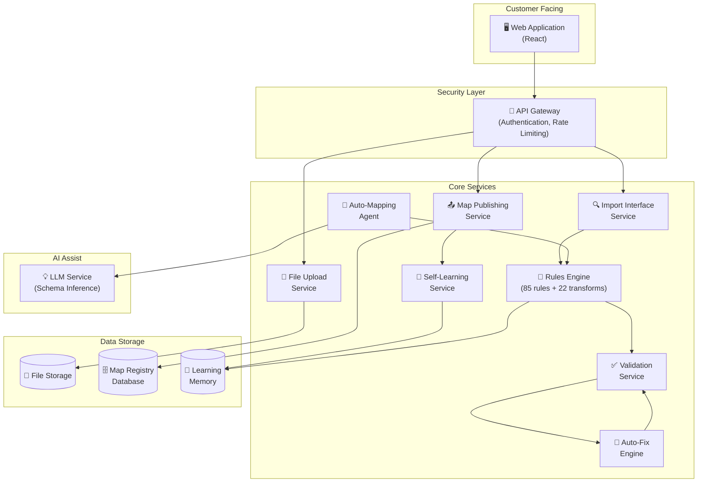
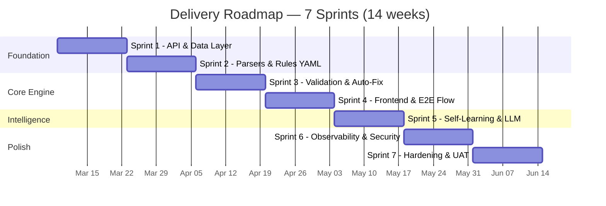
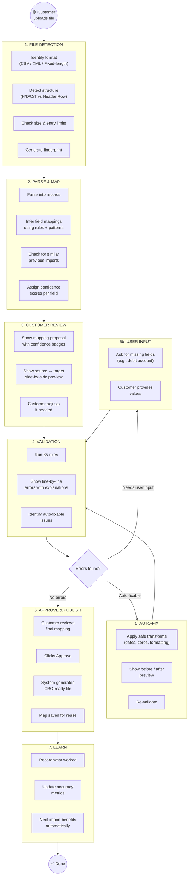

# Payment File Import Automation — Executive Summary

> **Version:** 1.0 &nbsp;|&nbsp; **Date:** 26 February 2026  
> **Audience:** Senior Leadership, Programme Sponsors, Business Stakeholders  
> **Status:** Proposal — Ready for Review

---

## 1. The Problem We're Solving

Every day, corporate banking customers import payment files into the Lloyds Commercial Banking Online (CBO) platform to make Bacs payments — salaries, supplier payments, bulk transfers.

**These imports fail too often, and fixing them is painful.**

Today's process is **manual, error-prone, and repetitive**:

```
┌────────────┐     ┌────────────────┐     ┌──────────────┐     ┌──────────────┐
│  Customer   │────▶│  Upload file   │────▶│  Manually    │────▶│  Fix errors  │
│  prepares   │     │  to CBO        │     │  map fields  │     │  one by one  │
│  payment    │     │                │     │  configure   │     │  re-upload   │
│  file       │     │                │     │  settings    │     │  repeat...   │
└────────────┘     └────────────────┘     └──────────────┘     └──────────────┘
                                                                      │
                                                                      ▼
                                                              Often 3-5 attempts
                                                              before success
```

Customers coming from different ERP systems (SAP, Oracle, etc.) each produce files in different formats — different date styles, column names, and structures. The CBO platform expects a very specific format, and even small deviations cause rejection.

**The result:** frustrated customers, high support ticket volumes, and lost confidence in the platform.

---

## 2. What Customers Are Telling Us

We identified **7 core pain points** from customer feedback, support tickets, and CBO operations team interviews:

```
╔══════════════════════════════════════════════════════════════════════════╗
║                    CUSTOMER PAIN POINTS                                  ║
╠══════════════════════════════════════════════════════════════════════════╣
║                                                                          ║
║  1. MAPPING HEADACHES         Wrong formats, lost leading zeros,         ║
║     📄 → ❌                   unknown file structures                    ║
║                                                                          ║
║  2. VALIDATION DEAD-ENDS      Invalid accounts, missing fields —         ║
║     ❌ → 🤷                   no guidance on what to fix                 ║
║                                                                          ║
║  3. UNHELPFUL ERRORS          "System error occurred" —                  ║
║     ⚠️ → 😤                   no explanation, no next steps              ║
║                                                                          ║
║  4. DUPLICATE SEQUENCES       Reusing header numbers →                   ║
║     🔄 → ❌                   repeated rejection                         ║
║                                                                          ║
║  5. LOST IN HISTORY           Can't find what went wrong                 ║
║     📋 → 🔍❓                 in previous imports                        ║
║                                                                          ║
║  6. INVISIBLE PROGRESS        "Where is my import?                       ║
║     ⏳ → 😰                   Did it work? Is it stuck?"                 ║
║                                                                          ║
║  7. SYSTEM DOESN'T LEARN      Fix the same issue every time —            ║
║     🔁 → 😩                   the system never remembers                 ║
║                                                                          ║
╚══════════════════════════════════════════════════════════════════════════╝
```

---

## 3. Our Proposed Solution

We propose building a **smart import assistant** that automates the hard parts of payment file importing while keeping humans in control of the important decisions.

### 3.1 The New Experience — In Simple Terms

```
  BEFORE (Today)                          AFTER (Proposed)
  ─────────────────                       ──────────────────────

  Customer maps fields manually           System figures out the mapping
                                          automatically and shows confidence
                                          scores

  Errors say "import failed"              Errors say exactly what's wrong,
                                          where, and how to fix it

  Customer fixes errors one by one        System auto-fixes common issues
                                          (dates, formatting, leading zeros)
                                          and shows before/after preview

  Same corrections every time             System remembers what worked and
                                          applies it next time automatically

  No idea where the import is             Real-time progress bar:
                                          uploading → parsing → validating →
                                          approved → published

  Header sequence rejected again          System detects duplicate sequences
                                          and suggests the next available one
```

### 3.2 How It Works — The Happy Path


**Step by step:**

| Step | What Happens | Who Does It |
|------|-------------|-------------|
| **1. Upload** | Customer drops their payment file (CSV, XML, or fixed-length text) into the system | Customer |
| **2. Auto-Detect** | System identifies the file type, structure, delimiter, encoding, and date format — automatically | System |
| **3. Smart Mapping** | System proposes how each column in the file maps to the required CBO fields, with a confidence score per field (High / Medium / Low) | System |
| **4. One-Click Validation** | System runs 85 validation rules covering every CBO requirement — returns clear, line-by-line results | System |
| **5. Auto-Fix** | System automatically fixes common formatting issues (wrong date format, missing decimal points, leading zeros, etc.) — 34 of the 85 rules have auto-fix capability | System |
| **6. User Review** | Customer reviews the proposed mapping and fixes, sees before/after preview, and clicks Approve | Customer |
| **7. Publish** | System saves the approved mapping, converts the file to CBO-ready format, and records the outcome | System |
| **8. Learn** | System remembers this successful mapping — next time a similar file arrives, it recommends the same approach | System |

---

## 4. How We Address Each Pain Point

| # | Pain Point | What We Build | How It Helps |
|---|-----------|---------------|-------------|
| 1 | **Mapping headaches** | Auto-detect file format + smart mapping engine with confidence scores | Customer no longer manually configures every field — system proposes the mapping in seconds |
| 2 | **Validation dead-ends** | 85-rule validation engine with line-level diagnostics and suggested fixes | Every error tells the customer exactly what went wrong, on which row, and what to do about it |
| 3 | **Unhelpful errors** | Explainability panel — "Why this failed" + "Why this fix is suggested" | Plain-English explanations replace cryptic system errors. AI-generated descriptions for complex cases |
| 4 | **Duplicate sequences** | Auto-detect reused header sequence numbers within 24 hours + auto-increment to next available | System catches the duplicate before CBO rejects it and offers a one-click fix |
| 5 | **Lost in history** | Unified import history with status filters, error breakdown, and searchable timeline | One screen shows every import, what happened, and why — no more switching between screens |
| 6 | **Invisible progress** | Real-time pipeline stepper: Upload → Parse → Map → Validate → Approve → Publish | Customer sees exactly where their import is at every moment |
| 7 | **System doesn't learn** | Mapping Memory that remembers corrections, promotes successful patterns, and auto-applies them | Fix something once — the system remembers it forever. Dashboard shows accuracy improving over time |

---

## 5. Validation Rules — What We Check

The system validates payment files against **85 rules** across 11 categories — catching every known CBO rejection reason **before** the file is submitted.

### 5.1 Rules at a Glance

```
                        85 VALIDATION RULES
  ┌─────────────────────────────────────────────────────-┐
  │                                                      │
  │  📁 FILE-LEVEL (8)        Size, encoding, schema     │
  │  🏗️ STRUCTURAL (10)       H/D/C/T sequencing, XML    │
  │  🔢 SEQUENCE (3)          Uniqueness, format         │
  │  📅 DATE/TIME (8)         Formats, business days     │
  │  💰 AMOUNT/CURRENCY (8)   Decimals, symbols, codes   │
  │  🏦 DEBIT ACCOUNT (8)     Sort code, account format  │
  │  👤 BENEFICIARY (11)      Name, account, sort code   │
  │  📄 XML-SPECIFIC (12)     Tags, namespaces, values   │
  │  📏 FIXED-LENGTH (6)      Positional field checks    │
  │  📊 ERP-EXPORT (5)        Header detection, columns  │
  │  🔗 CROSS-CUTTING (6)     Whitespace, encoding       │
  │                                                      │
  │  ─────────────────────────────────────────────────   │
  │  TOTAL: 85 rules                                     │
  │  Auto-fixable: 34 │ Prompt user: 6 │ Not fixable: 45 │
  └─────────────────────────────────────────────────────-┘
```

> **Note:** These 85 rules are not pulled from a single CBO API or website. They are our **structured engineering interpretation** of what CBO accepts and rejects, compiled from:
> - Lloyds CBO documentation (*"How to import Bacs payments in XML"*, *"Import errors explained"*, *"Template files for importing payments"*)
> - Golden reference files (`BACS_v4.xml`, example BACS CSV)
> - ISO 20022 `pain.001.001.03` XSD specification
> - Sample input files (fixed-length, ERP CSV exports)
>
> All rules are **configurable in YAML** — we can add, modify, or disable rules without code changes.

### 5.2 Auto-Fix Capability

Of the 85 rules, **34 have automatic fixes** — deterministic, safe, auditable transformations that the system can apply with one click:

| Fix Type | What It Does | Example |
|----------|-------------|---------|
| **Date reformatting** | Converts between date formats automatically | `19.12.16` → `20161219` |
| **Year expansion** | Handles 2-digit years safely | `16` → `2016` |
| **Leading zero restoration** | Preserves sort code and account number zeros | `99301` → `099301` |
| **Currency symbol removal** | Strips £, $, € from amounts | `£1,500.00` → `1500.00` |
| **Comma stripping** | Removes commas from numbers | `1,500.00` → `1500.00` |
| **Decimal insertion** | Adds decimal point to whole numbers | `1500` → `1500.00` |
| **Pence-to-pounds** | Converts integer pence to decimal pounds | `150000` → `1500.00` |
| **Sequence auto-increment** | Generates next unique header sequence number | `00047` (duplicate) → `00048` |
| **XML tag correction** | Sets required fixed values and empty elements | Auto-set `<PmtMtd>TRA</PmtMtd>` |
| **Invalid character removal** | Strips characters outside BACS character set | `Café Ltd` → `Caf Ltd` |

**Key principle:** All fixes are **deterministic and reversible** — no AI guessing. The customer always sees a before/after preview and must approve.

### 5.3 What the Validation Catches — Real Examples

| Scenario | Rule | What the Customer Sees |
|---------|------|----------------------|
| Beneficiary account has 7 digits instead of 8 | VR-BEN-002 | "Beneficiary account number must be exactly 8 digits. Current: `1234567`. Suggested fix: left-pad with zero → `01234567`" |
| Date in European format (`19.12.16`) | VR-DATE-002, VR-DATE-006 | "Date format `DD.MM.YY` detected. Auto-fix: convert to `20161219`" |
| Header sequence `00047` was used 3 hours ago | VR-SEQ-002 | "Sequence number `00047` was already used today. Auto-fix: increment to `00048`" |
| Amount has a comma | VR-AMT-004 | "Amount `1,500.00` contains commas. Auto-fix: remove comma → `1500.00`" |
| Missing debit account in ERP export | VR-DBT-001 | "Debit account is missing from this file. Please provide the sort code and account number" |

---

## 6. Architecture Overview — How It's Built

### 6.1 High-Level Architecture



### 6.2 What Each Service Does

| Service | Purpose | Analogy |
|---------|---------|---------|
| **File Upload** | Receives and stores the customer's file safely | The mailroom — accepts incoming post |
| **Import Interface** | Figures out what kind of file it is and breaks it into individual records | The sorter — opens the envelope and organises the contents |
| **Rules Engine** | Holds all 85 validation rules and 22 fix transforms as configuration (not hardcoded) | The rulebook — all the rules are written down, not memorised |
| **Validation Service** | Checks every record against the rules and reports what's wrong | The inspector — checks everything against the rulebook |
| **Auto-Fix Engine** | Applies safe, automatic corrections (dates, formatting, zeros) | The assistant — fixes obvious typos before you notice them |
| **Auto-Mapping Agent** | Orchestrates the end-to-end flow from upload to publish | The project manager — coordinates everyone |
| **Map Publishing** | Saves the approved mapping and generates the CBO-ready output file | The publisher — produces the final document |
| **Self-Learning** | Remembers what worked and applies it automatically next time | The team memory — institutional knowledge that doesn't leave when someone does |
| **LLM Service** | Uses AI to help with ambiguous column names when the rules aren't enough | The consultant — brought in for tricky questions only |

### 6.3 Design Principles — Why We Built It This Way

| Principle | What It Means | Why It Matters |
|-----------|--------------|---------------|
| **Rules in Config, Not Code** | All 85 rules and 22 transforms are defined in YAML files. Adding a new rule doesn't require code changes. | Business teams can adjust rules without a development cycle. Faster response to new CBO requirements. |
| **Deterministic Fixes Only** | Auto-fix never guesses. Every correction follows a known, documented transformation. | Auditable. No surprises. Regulators can review every fix rationale. |
| **Human Approval Required** | No file is submitted to CBO without explicit customer approval. | Customers stay in control. Zero risk of unintended payments. |
| **AI Assists, Never Decides** | The LLM helps with ambiguous column names but its suggestions are always validated by the rules engine before being shown. | No hallucinated field mappings. AI is a helper, not an authority. |
| **Works Locally, Scales to Cloud** | Developers can run the full system on a laptop (SQLite + local files). Production runs on Google Cloud (Spanner + GCS). Same code, different configuration. | Fast development. No cloud costs during development. Seamless deployment when ready. |
| **Learns Without Machine Learning** | Self-learning uses simple counters and history — no ML training pipelines. | Transparent, explainable, lightweight. Easy to audit. No GPU infrastructure needed. |

---

## 7. Technology Choices

### 7.1 Technology Stack — At a Glance

```
  ┌─────────────────────────────────────────────────────────┐
  │                     FRONTEND                            │
  │   React 18 + TypeScript + Tailwind CSS + Vite           │
  │   (Modern, accessible, responsive web application)      │
  └────────────────────────┬────────────────────────────────┘
                           │ HTTPS
  ┌────────────────────────▼────────────────────────────────┐
  │                   API GATEWAY                           │
  │   Authentication, Rate Limiting, Routing                │
  └────────────────────────┬────────────────────────────────┘
                           │
  ┌────────────────────────▼────────────────────────────────┐
  │                    BACKEND                              │
  │   Java 21 + Quarkus Framework                           │
  │   (Fast startup, low memory, cloud-native)              │
  └────────────────────────┬────────────────────────────────┘
                           │
  ┌────────────────────────▼────────────────────────────────┐
  │                   DATA LAYER                            │
  │                                                         │
  │   Development          │   Production (GCP)             │
  │   ─────────────        │   ──────────────────           │
  │   SQLite database      │   Cloud Spanner (DB)           │
  │   Local file system    │   Cloud Storage (files)        │
  │   Ollama (local AI)    │   Vertex AI (cloud AI)         │
  │                        │   Pub/Sub (events)             │
  └─────────────────────────────────────────────────────────┘
```

### 7.2 Why These Technologies?

| Choice | Rationale |
|--------|-----------|
| **Java 21** | Enterprise-standard, strong typing, excellent performance with Virtual Threads, large talent pool |
| **Quarkus** | Fast startup (~1s), low memory usage, cloud-native design, built-in dependency injection |
| **React** | Industry-leading UI framework, large ecosystem, TypeScript for safety |
| **SQLite for local dev** | Zero-install database, instant setup for developers, mirrors the production schema |
| **Google Cloud** | Lloyds' preferred cloud provider; Spanner for global consistency, GCS for file storage |
| **YAML-driven rules** | Business logic separate from code; rules can be added/updated without redeployment |

---

## 8. Supported File Formats

The system handles **4 input formats** and converts them to **2 CBO-ready output formats**:

```
         INPUT FORMATS                         OUTPUT FORMATS
  ┌──────────────────────┐              ┌──────────────────────┐
  │  📊 CBO CSV          │              │                      │
  │  (H/D/C/T records)   │──────┐      │  📊 BACS CSV         │
  │                      │      │      │  (CBO-ready format)  │
  ├──────────────────────┤      │      │                      │
  │  📊 ERP CSV          │      ├─────▶│                      │
  │  (SAP, Oracle export)│      │      ├──────────────────────┤
  │                      │      │      │                      │
  ├──────────────────────┤      │      │  📄 BACS XML         │
  │  📄 BACS XML         │      │      │  (pain.001.001.03)   │
  │  (pain.001.001.03)   │──────┤      │                      │
  │                      │      │      └──────────────────────┘
  ├──────────────────────┤      │
  │  📏 Fixed-Length      │      │
  │  (BACS Standard 18)  │──────┘
  │                      │
  └──────────────────────┘
```

| Format | File Type | Max Size | Max Entries | Key Challenge |
|--------|----------|----------|-------------|---------------|
| CBO CSV | `.csv` | 0.5 MB | 1,250 (single-debit) | H/D/C/T record sequencing |
| ERP CSV | `.csv` | 0.5 MB | 2,500 | Non-standard column names, different date formats, missing fields |
| BACS XML | `.xml` | 6 MB | 2,500 | ISO 20022 namespace validation, empty element tags, conditional subtree removal |
| Standard 18 | `.txt` | — | 2,500 | Fixed-width positional parsing, amounts in pence |

---

## 9. Delivery Plan

The proposed delivery follows a **7-sprint plan** (2-week sprints), building capability incrementally:



### 9.1 Sprint Breakdown

| Sprint | What We Deliver | Key Outcome |
|--------|----------------|-------------|
| **1** | API skeleton, database schema, file upload, OpenAPI spec | Developers can upload a file and track it through the system |
| **2** | CSV/XML/fixed-length parsers, 85 validation rules in YAML, file type detection | System can parse any supported file format |
| **3** | Rules engine implementation, 22 auto-fix transforms, validation pipeline | System can validate files and auto-fix common errors |
| **4** | React frontend (all 7 screens), end-to-end upload-to-publish flow | Business users can use the complete workflow |
| **5** | Self-learning memory, mapping corrections, LLM-assisted mapping, learning UI indicators | System starts remembering and improving |
| **6** | Logging, tracing, metrics, security hardening, OWASP compliance checks | Production-ready observability and security |
| **7** | Performance testing, golden file regression suite, UAT with stakeholders | Confident, tested system ready for pilot |

### 9.2 Post-MVP (Sprint 8+)

- Google Cloud deployment (Cloud Run, Spanner, GCS)
- Apigee API Gateway integration
- Multi-tenant support at scale
- Additional payment types (Faster Payments, CHAPS, International)

---

## 10. The Workflow Pipeline — End to End

This diagram shows the complete import workflow from file upload to published output:



---

## 11. What Success Looks Like

### 11.1 Target Outcomes

| Metric | Today (Estimated) | Target | How We Measure |
|--------|-------------------|--------|---------------|
| **First-pass import success rate** | ~40-50% | >80% | % of imports that pass validation on first attempt |
| **Time to successful import** | 15-30 minutes (with retries) | <5 minutes | Average time from upload to published map |
| **Support ticket reduction** | Baseline | -50% | Import-related support tickets per month |
| **Map reuse rate** | ~0% (manual process) | >60% | % of imports that use a previously saved mapping |
| **Customer satisfaction** | Baseline | +30 NPS points | Post-import survey |

### 11.2 Expected Benefits

```
  FOR CUSTOMERS                          FOR THE BUSINESS
  ──────────────                         ─────────────────

  ✅ Faster imports — minutes,           ✅ Fewer support tickets
     not half-hours                         and escalations

  ✅ Clear explanations when             ✅ Lower operational cost
     something goes wrong                   per import

  ✅ System gets smarter over            ✅ Competitive advantage —
     time — less manual work                modern, automated platform

  ✅ Confidence that imports             ✅ Reduced risk of payment
     will work first time                   processing delays

  ✅ No more duplicate sequence          ✅ Scalable — handles more
     rejections                             customers without more staff
```

---

## 12. Risk Management

| Risk | Impact | Mitigation |
|------|--------|-----------|
| **Auto-fix changes data incorrectly** | High — incorrect payments | Only deterministic, allowlisted transforms are permitted. Customer must approve every fix with before/after preview. Audit trail for every change. |
| **AI suggests wrong field mapping** | Medium — wasted time | AI suggestions are always validated by the rules engine before being shown. AI assists — it never decides. |
| **Customer files change format over time** | Medium — missed mappings | Versioned rule packs with controlled rollout. File fingerprinting detects new patterns. |
| **Data security / tenant isolation** | High — regulatory | Strict tenant scoping, encrypted storage, PII masking in logs, OAuth2 authentication, OWASP compliance. |
| **Scope creep beyond Bacs** | Medium — delays | Phase 1 is Bacs-only. Additional payment types are deferred to Phase 2 with clear boundaries. |

---

## 13. Prototype

A **fully clickable HTML prototype** has been built to demonstrate the proposed user experience. It covers:

- **7 screens**: Dashboard, Upload, Import Detail, Mapping Review, Validation Results, Publish & Approve, Maps Registry
- **4 modals**: Missing Fields prompt, Auto-Fix Preview (with before/after), Explainability Panel, Publish Success
- **Self-learning indicators**: Dashboard learning banner, per-field "Learned" / "Remembered" labels

> **To view**: Open `prototype/index.html` in any browser — no installation or internet connection required.  
> **Feature guide**: See `prototype/PROTOTYPE_GUIDE.md` for a detailed walkthrough.

---

## 14. Recommendation

We recommend **proceeding with the proposed 7-sprint delivery plan** to build the local MVP, followed by cloud deployment in Sprint 8+.

**Immediate next steps:**

1. **Review this proposal** with programme sponsors and key stakeholders
2. **View the prototype** to validate the proposed user experience
3. **Confirm technology decisions** (5 items pending team alignment)
4. **Secure sprint team** and begin Sprint 1 (API foundation + data layer)

---

## 15. Document References

| Document | Location | Purpose |
|----------|----------|---------|
| Detailed Requirements | `docs/detailed_requirements.md` (v1.2) | Full functional and non-functional requirements, 85 validation rules, 5 appendices |
| Architecture Document | `docs/architecture.md` (v1.5) | Service decomposition, data model, API design, design patterns, technology stack |
| Implementation Plan | `docs/implementation_plan.md` (v1.2) | 7-sprint delivery plan with tasks, verification criteria, and risk log |
| Pain Point Treatment | `docs/painpoint_treatment.md` | Original customer pain point analysis |
| Clickable Prototype | `prototype/index.html` | Interactive HTML prototype — 7 screens, 4 modals |
| Prototype Guide | `prototype/PROTOTYPE_GUIDE.md` (v1.2) | Screen-by-screen feature walkthrough |
| YAML Rule Configuration | `config/rules/validation-rules.yaml` | All 85 validation rules as data |
| YAML Transform Configuration | `config/rules/transforms.yaml` | All 22 auto-fix transforms as data |

---

*Prepared for Senior Leadership Review — 26 February 2026*
