# Payment File Import Automation — Detailed Architecture Document

## 1. Document Control

| Attribute | Value |
|---|---|
| Version | `1.5` |
| Date | `2026-02-26` |
| Status | Draft |
| Based On | `docs/detailed_requirements.md` v1.2 (incl. §4 Customer Pain Points) |
| Audience | Engineering, Architecture Review, Platform Engineering |

---

## 2. Architecture Principles

| # | Principle | Rationale |
|---|---|---|
| AP-1 | **Event-Driven Decoupling** | Services communicate via Pub/Sub topics; no synchronous inter-service calls on the critical path unless latency-sensitive. |
| AP-2 | **Deterministic-Only Auto-Fix** | No probabilistic or ML-driven transforms. Every auto-fix must be reproducible from its rule definition alone. |
| AP-3 | **Human-in-the-Loop Gating** | No map is published or file submitted to CBO without explicit user approval. |
| AP-4 | **Tenant Isolation** | All data paths — storage, messaging, API routing — are scoped to a single tenant. Cross-tenant data leakage is treated as a P0 security incident. |
| AP-5 | **Explainability** | Every validation failure and every auto-fix carries a machine-readable rationale so the UI and audit log can answer "why". |
| AP-6 | **Idempotent Processing** | Every Pub/Sub-triggered stage is idempotent. Duplicate message delivery must not produce side effects. |
| AP-7 | **Schema-First Contracts** | All API and event schemas are defined before implementation. Breaking changes require versioned migration. |
| AP-8 | **Least Privilege** | Each service account is granted the minimum IAM roles needed. Workload Identity Federation is preferred over service account keys. |
| AP-9 | **Environment Parity** | Dev and Prod share the same service interfaces, API contracts, and business logic. Only infrastructure bindings differ (local processes + SQLite + Ollama in Dev; Cloud Run + Spanner/Firestore + managed LLM in Prod). Configuration is driven by a single `ENV` profile (`dev` / `prod`). |
| AP-10 | **Externalized Configuration** | All business rules, validation thresholds, transform definitions, and feature toggles are declared as external YAML configuration — never hardcoded in Java. Adding, removing, or modifying a rule requires only a config change + restart, not a code change. Follows 12-Factor App Factor III (Config). |
| AP-11 | **SOLID Principles** | **SRP**: Each evaluator class handles exactly one rule type. **OCP**: New rules are added via YAML + a new evaluator key — existing code is never modified. **LSP**: All evaluators are substitutable via the `RuleEvaluator` interface. **ISP**: Fine-grained interfaces (`Rule`, `Transform`, `Evaluator`) — no god-interfaces. **DIP**: Services depend on abstractions (`RuleRegistry`, `TransformRegistry`, `FileStorageService`) not concrete implementations. |
| AP-12 | **OWASP Compliance** | XXE protection (disable external entities in StAX), input validation (Hibernate Validator on all DTOs), PII masking in logs, file upload magic-byte verification, Content-Type validation, path traversal prevention, parameterized queries (no SQL injection), dependency scanning (OWASP Dependency-Check in CI). |
| AP-13 | **Cloud-Native 12-Factor** | I. Codebase (single repo, multi-module). II. Dependencies (Maven BOM). III. Config (externalized YAML). IV. Backing Services (DB, LLM as attached resources via config). V. Build/Release/Run (Jib + Cloud Build). VI. Processes (stateless services, state in DB). VII. Port Binding (self-contained Quarkus). VIII. Concurrency (Cloud Run horizontal scaling). IX. Disposability (fast startup, graceful shutdown). X. Dev/Prod Parity (repository abstraction). XI. Logs (structured JSON to stdout). XII. Admin (init-db.sh, migration scripts). |
| AP-14 | **Design Patterns** | Organized by GoF category — see table below. |
| AP-15 | **Microservices Design Patterns** | See table below — covers API Gateway, Saga, Circuit Breaker, Bulkhead, Database per Service, Health Probes, Service Discovery, CQRS, Strangler Fig, Sidecar. |
| AP-16 | **REST API Design Principles** | See table below — covers URI versioning, RFC 7807 error responses, pagination, content negotiation, idempotency keys, ETags, HATEOAS-lite, HTTP method semantics. |

#### AP-14 Design Patterns — Creational, Structural, Behavioral

| Category | Pattern | Where Applied |
|---|---|---|
| **Creational** | **Factory Method** | `YamlRuleRegistry.loadRules()` creates `RuleDefinition` instances from YAML. `YamlTransformRegistry.loadTransforms()` creates `TransformDefinition` instances. |
| | **Abstract Factory** | `EvaluatorFactory` produces a family of related `RuleEvaluator` implementations keyed by evaluator type. `TransformerFactory` does the same for `Transformer` implementations. Each factory resolves CDI `@Named` beans — the caller never knows the concrete class. |
| | **Singleton** | CDI `@ApplicationScoped` beans act as singletons: `YamlRuleRegistry`, `YamlTransformRegistry`, `EvaluatorFactory`, `TransformerFactory`, all `*Repository` implementations. Managed by the Quarkus CDI container — no manual singleton boilerplate. |
| | **Builder** | `ValidationResult.builder()` for constructing complex validation results with optional fields. `ImportEntity.builder()` for assembling import records. |
| **Structural** | **Adapter** | Repository abstraction layer adapts different storage backends behind a common interface: `SqliteImportRepository` ↔ `SpannerImportRepository` both implement `ImportRepository`. `LocalFileStorageService` ↔ `GcsFileStorageService` both implement `FileStorageService`. `OllamaLlmService` ↔ `VertexAiLlmService` both implement `LlmService`. |
| | **Facade** | `ValidationService` is a facade over `YamlRuleRegistry` + `RuleEngine` + confidence scoring + error formatting — callers invoke one method, not four subsystems. `AutoFixService` facades `YamlTransformRegistry` + `TransformerFactory` + re-validation loop. |
| | **Composite** | Rule evaluation phases form a composite tree: a `RulePhase` (STRUCTURAL, FIELD_LEVEL, FORMAT_SPECIFIC, CROSS_CUTTING) is a composite node containing leaf `RuleDefinition` entries. The `RuleEngine` evaluates the tree uniformly. |
| | **Decorator** | Evaluators can be wrapped with cross-cutting decorators: `TimingEvaluatorDecorator` (adds latency metrics), `LoggingEvaluatorDecorator` (structured audit logging). Decorators implement `RuleEvaluator` and delegate to the wrapped evaluator — transparent to callers. |
| | **Proxy** | Quarkus CDI generates proxies for `@ApplicationScoped` beans (lazy initialization, interceptor support). REST client interfaces (`@RegisterRestClient`) are proxied at runtime for LLM and external service calls. |
| **Behavioral** | **Strategy** | `EvaluatorFactory` / `TransformerFactory` resolve concrete implementations by key from YAML config. The `evaluator` field in `validation-rules.yaml` selects the algorithm at runtime. Swapping strategy = changing one YAML key. |
| | **Chain of Responsibility** | Rule evaluation pipeline: STRUCTURAL → FIELD_LEVEL → FORMAT_SPECIFIC → CROSS_CUTTING. Each phase processes the request and passes results to the next. A structural failure (e.g., missing header) can short-circuit the chain. |
| | **State** | `ImportStateMachine` enforces legal state transitions: CREATED → PARSING → PROPOSING → VALIDATING → FIXING / AWAITING_INPUT → APPROVED → PUBLISHED → COMPLETED. Invalid transitions throw `IllegalStateException`. Each state determines which operations are permitted. |
| | **Template Method** | `AbstractRuleEvaluator` base class provides the common flow: extract field → validate preconditions → evaluate → build result. Subclasses override only the `doEvaluate()` step. |
| | **Observer** | Event-driven state transitions via CDI `@Observes` events (dev) / Pub/Sub messages (prod). Services react to `FILE_UPLOADED`, `MAP_PROPOSED`, `VALIDATION_DONE`, `MAP_PUBLISHED` events without coupling to the publisher. |
| | **Iterator** | `RuleEngine` iterates over rules within each phase, yielding `ValidationResult` items. Rules are filtered by `appliesTo` (file type) and `enabled` flag before iteration. Lazy evaluation avoids processing rules for irrelevant file types. |

#### AP-15 Microservices Design Patterns

| Pattern | Category | Where Applied | Status |
|---|---|---|---|
| **API Gateway** | Infrastructure | Apigee sits in front of all 11 services — handles AuthN/AuthZ (OAuth2 + JWT), rate limiting (5 concurrent imports/tenant), correlation ID injection (`X-Correlation-Id`), quota enforcement, request routing. No client ever calls a backend service directly. | Designed |
| **Saga (Orchestration)** | Data Consistency | `ImportStateMachine` acts as a saga orchestrator. Each state transition (CREATED → PARSING → PROPOSING → VALIDATING → FIXING → APPROVED → PUBLISHED) is a saga step. **Compensating actions**: PARSING failure → mark FAILED + delete staged file; VALIDATING failure → preserve partial results + allow retry; FIXING failure → roll back transform batch + revert to pre-fix CRM snapshot; PUBLISHING failure → mark FAILED + retain validated map for retry. Each step is idempotent (AP-6). | Designed |
| **Circuit Breaker** | Resilience | Applied on Rules Engine gRPC calls and Ollama/Vertex AI LLM calls. Three states: **CLOSED** (normal), **OPEN** (fail-fast after 5 consecutive failures, 30s timeout), **HALF-OPEN** (probe single request). Implementation: Quarkus `@CircuitBreaker` (MicroProfile Fault Tolerance). Fallback: Rules Engine → cached last-known-good rule results; LLM → skip to manual prompt flow. Metrics: `circuit_breaker_state`, `circuit_breaker_calls_total` exposed via Micrometer. | Designed |
| **Bulkhead** | Resilience | **Thread-pool isolation** per service dependency: Rules Engine calls get a dedicated pool (max 20 threads), LLM calls get a separate pool (max 5 threads, 15s timeout), DB calls use Agroal connection pool (max 10 connections). Prevents a slow LLM from starving rule evaluation. Implementation: Quarkus `@Bulkhead` (MicroProfile Fault Tolerance). | Designed |
| **Database per Service** | Data Isolation | In production: **Spanner** owned by Map Publishing/Registry services; **Firestore** owned by Self-Learning Service; **GCS** owned by File Upload Service. No direct cross-service DB access — services communicate via APIs and events only. In dev: single SQLite file with logical schema separation per service via repository abstraction. | Designed |
| **Health Probes** | Observability | Every service exposes three endpoints: `GET /q/health/live` (liveness — process alive), `GET /q/health/ready` (readiness — DB connected + rule YAML loaded + dependencies reachable), `GET /q/health/started` (startup — initial YAML parse complete). Implementation: Quarkus SmallRye Health (MicroProfile Health). Cloud Run configures startup probe (HTTP `/q/health/started`, 10s interval, 3 failures → restart), liveness probe (HTTP `/q/health/live`, 30s interval), readiness probe not needed for Cloud Run (handled by startup). | Designed |
| **Service Discovery** | Infrastructure | Cloud Run provides built-in service discovery via Cloud Run service URLs (`https://{service}-{hash}-{region}.a.run.app`). Inter-service calls use environment-injected base URLs (e.g., `RULES_ENGINE_URL`). In dev: services run on fixed localhost ports (8081–8088). No external service registry needed — Cloud Run + Apigee handle routing. | Designed |
| **Event-Driven / Choreography** | Communication | 7 Pub/Sub topics (prod) / CDI events (dev) decouple services. Services publish events and subscribe independently — no point-to-point REST calls on the async path. Ordering keys per `importId` ensure in-order processing. DLQ with 5-retry exponential backoff. | Designed |
| **CQRS (Light)** | Data Access | Read and write paths are separated at the API level: **Write path** (upload, validate, fix, publish) → transactional writes to primary store. **Read path** (status, history, maps, recommendations) → read-optimized queries, potentially from read replicas (Spanner multi-read). Not full event-sourced CQRS — state is stored directly, but the `mapping_history` table provides an append-only audit trail of all map mutations. | Designed |
| **Strangler Fig** | Migration | Applicable for Sprint 8+ (prod GCP migration). New file import flow runs in parallel with any existing manual process. Traffic is gradually shifted via Apigee routing rules (percentage-based canary). The legacy path is strangled once the new system handles 100% of traffic. Anti-corruption layer: `CboOutputAdapter` translates `CanonicalRecordModel` to legacy CBO CSV format, insulating the new domain model from legacy format constraints. | Planned (S8+) |
| **Sidecar** | Infrastructure | Cloud Run second-generation supports sidecar containers. Used for: (1) **OpenTelemetry Collector sidecar** — collects traces/metrics from the main container and exports to Cloud Trace/Monitoring without coupling application code to GCP SDKs; (2) **Cloud SQL Auth Proxy sidecar** — if future migration to Cloud SQL is needed. In dev: not applicable (single process). | Planned (S8+) |
| **Retry with Backoff** | Resilience | All inter-service calls: max 3 retries, exponential backoff (100ms → 200ms → 400ms), jitter. Pub/Sub: max 5 retries, exponential backoff (10s → 300s), then DLQ. Spanner: max 3 retries on `ABORTED` transactions. Implementation: Quarkus `@Retry` (MicroProfile Fault Tolerance) for synchronous calls; Pub/Sub native retry for async. | Designed |
| **Timeout** | Resilience | Every external call has an explicit timeout: Rules Engine gRPC (5s), LLM/Ollama (15s dev, 5s prod), Spanner transactions (10s), file upload staging (30s), Cloud Run request timeout (60s). Implementation: Quarkus `@Timeout` (MicroProfile Fault Tolerance). | Designed |

#### AP-16 REST API Design Principles

| Principle | Implementation | Details |
|---|---|---|
| **URI Versioning** | All endpoints prefixed with `/v1/`. | Version in path (not header or query param). When breaking changes are needed, `/v2/` endpoints are added alongside `/v1/` with Apigee routing. Deprecation policy: `/v1/` supported for 6 months after `/v2/` GA. |
| **HTTP Method Semantics** | Strict adherence to RFC 7231. | `GET` = safe + idempotent (reads). `POST` = non-idempotent (create/action); idempotency achieved via fingerprint dedup on upload. `PUT` = idempotent (full replacement of proposal). `DELETE` = not exposed (soft-delete via state machine). |
| **RFC 7807 Problem Details** | All error responses use `application/problem+json`. | Format: `{ "type": "urn:fileimport:error:{code}", "title": "{human-readable}", "status": {httpStatus}, "detail": "{specific message}", "instance": "/v1/imports/{importId}", "correlationId": "{X-Correlation-Id}", "errors": [{ruleId, location, message, suggestion}] }`. The `errors` array extends RFC 7807 for validation-specific detail. |
| **Pagination** | Cursor-based pagination for list endpoints. | `GET /v1/imports/history?cursor={opaqueCursor}&limit=20` and `GET /v1/maps?cursor={opaqueCursor}&limit=20`. Response includes `{ "data": [...], "pagination": { "nextCursor": "...", "hasMore": true, "totalCount": 142 } }`. Cursor is an opaque Base64-encoded token (not offset-based — immune to insert/delete drift). Default limit: 20, max: 100. |
| **Content Negotiation** | `Accept` header determines response format. | All API responses default to `application/json`. `GET /v1/imports/{importId}/output` supports `Accept: text/csv` (CBO CSV output) and `Accept: application/xml` (pain.001.001.03 XML output). `Content-Type: multipart/form-data` for upload. Unsupported `Accept` → `406 Not Acceptable`. |
| **Idempotency Keys** | `Idempotency-Key` header on mutating `POST` endpoints. | `POST /v1/imports/upload` uses file fingerprint (SHA-256) as implicit idempotency key. `POST /v1/imports/{importId}/fix` and `/publish` accept optional `Idempotency-Key` header — if the same key is seen within 24h, return the cached response (HTTP 200, not re-processed). Stored in `idempotency_keys` table with TTL. |
| **ETags / Conditional Requests** | `ETag` on mutable resources. | `GET /v1/imports/{importId}/proposal` returns `ETag: "{version-hash}"`. `PUT /v1/imports/{importId}/proposal` requires `If-Match: "{etag}"` — prevents lost-update problem when two users edit the same proposal. Stale `If-Match` → `412 Precondition Failed`. `GET` requests support `If-None-Match` → `304 Not Modified` (bandwidth savings for polling). |
| **HATEOAS-lite** | Navigational links in key responses. | Not full HAL/JSON:API, but key responses include a `_links` object: `UploadResponse._links: { status, proposal, validate }`, `ValidationSummary._links: { fix, prompt, publish, preview }`, `PublishResult._links: { map, output, history }`. Enables frontend to follow workflow transitions without hardcoding URLs. |
| **Rate Limiting Headers** | Standard rate limit headers in every response. | `X-RateLimit-Limit: 100` (max requests/minute), `X-RateLimit-Remaining: 87`, `X-RateLimit-Reset: 1740000000` (Unix epoch). When exceeded: `429 Too Many Requests` with `Retry-After` header. Enforced at Apigee layer. |
| **Request Validation** | Fail-fast validation on all inputs. | Hibernate Validator `@Valid` on all request DTOs. Invalid requests → `400 Bad Request` with RFC 7807 body listing all constraint violations. File uploads validated: size, Content-Type whitelist, magic bytes, filename sanitization (path traversal prevention). |

#### Customer Pain Point Traceability

This architecture explicitly addresses all 7 customer pain points defined in `detailed_requirements.md` §4:

| Pain Point | Architecture Coverage |
|---|---|
| #1 Mapping & File Structure Issues | §5.4 (File Type Detection, Schema Inference), §5.5 (Rules Engine — 85 rules), §5.7 (Auto-Fix Engine) |
| #2 Data Validation Failures | §5.6 (Validation Service), §5.7 (Auto-Fix Engine — 22 transforms) |
| #3 No Clear Error Messages | §5.6 (Structured JSON errors), §5.11 (LLM explainability text), §5.1 (Explainability Panel) |
| #4 Duplicate Header Sequences | §5.4 (Sequence uniqueness detection), §5.7 (TF-SEQ-INCREMENT auto-fix), §6.4 (`sequence_numbers` table) |
| #5 Import History | §5.1 (Import History View), §7.1 (API #14 — `/v1/imports/history`), §6.4 (`imports` table) |
| #6 Perceived Delays | §5.1 (Real-time status via SSE/WebSocket), §9.1 (Pipeline stepper with stage-by-stage progress) |
| #7 Self-Learning | §5.10 (Self-Learning Service + mapping corrections + accuracy metrics), §5.1 (Learning banner + per-field indicators), §7.1 (APIs #16-17) |

---

## 2A. Technology Stack

> **Purpose**: Single reference for all technology choices. Items marked **DECIDED** are locked in. Items marked **TO DECIDE** require team discussion before Sprint 1.

### 2A.1 Decided Technologies

#### Frontend

| Concern | Technology | Version / Notes |
|---|---|---|
| **UI Framework** | **React** | v18+ (TypeScript). Component library TBD (see 2A.2). |
| **CSS Framework** | **Tailwind CSS** | v3+. Utility-first; purge unused styles in prod build. |
| **Build Tool** | Vite | Fast HMR for dev; optimized production bundles. |
| **State Management** | TBD — see 2A.2 | React Query (server state) + Zustand or Context (UI state). |
| **HTTP Client** | TBD — see 2A.2 | Axios or native `fetch` wrapper. |
| **Routing** | React Router | v6+. |
| **Hosting (Dev)** | Vite dev server | `localhost:5173`. |
| **Hosting (Prod)** | Cloud Run | Static build served via nginx container. |

#### Backend Microservices

| Concern | Technology | Version / Notes |
|---|---|---|
| **Language** | **Java** | 21+ (LTS). Virtual threads (Project Loom) for high-throughput I/O. |
| **Framework** | **Quarkus** | v3+. Supersonic Subatomic Java — fast startup, low memory, native-image capable. |
| **Build Tool** | Maven (or Gradle) | Quarkus Maven plugin for dev mode (`quarkus:dev`) and native builds. |
| **REST API** | Quarkus RESTEasy Reactive | JAX-RS annotations, non-blocking I/O. |
| **Serialisation** | Jackson | JSON binding; also used for CRM serialisation. |
| **Validation** | Hibernate Validator | Bean Validation 3.0 (`jakarta.validation`). |
| **XML Parsing** | StAX (`javax.xml.stream`) | Streaming parser for `pain.001.001.03` — memory-efficient for files up to 6 MB. |
| **CSV Parsing** | Apache Commons CSV or OpenCSV | Handles H/D/C/T and ERP formats. |
| **DI / Config** | Quarkus CDI + SmallRye Config | Profile-based config (`application.properties`, `application-dev.properties`, `application-prod.properties`). |
| **Testing** | JUnit 5 + Quarkus Test + REST Assured | `@QuarkusTest` for integration; `@QuarkusTestProfile` for environment switching. |
| **Containerisation** | Jib or Quarkus Container Image | Distroless base image; optional GraalVM native-image for prod. |

#### Data & Storage

| Concern | Dev (Local) | Prod (GCP) | Notes |
|---|---|---|---|
| **Relational DB** | **SQLite** (via JDBC) | **Cloud Spanner** | Repository abstraction layer (Section 6.5). |
| **Document DB** | **SQLite** (JSON columns) | **Firestore** | Self-learning counters, session state. |
| **File Storage** | Local filesystem (`./data/storage/`) | **GCS** | Tenant-scoped prefix layout. |
| **Event Bus** | In-process (CDI Events / direct method calls) | **Pub/Sub** (7 topics) | Quarkus CDI `@Observes` for dev; Pub/Sub client for prod. |
| **JDBC Driver (Dev)** | `org.xerial:sqlite-jdbc` | Spanner JDBC | Switchable via Quarkus datasource config profiles. |

#### LLM / AI

| Concern | Dev (Local) | Prod (GCP) | Notes |
|---|---|---|---|
| **LLM Runtime** | **Ollama** (`localhost:11434`) | **Vertex AI** (Gemini) | OpenAI-compatible `/v1/chat/completions` API both sides. |
| **LLM Client** | HTTP client (Quarkus REST Client Reactive) | Same client, different `base-url` | No SDK lock-in — pure HTTP + JSON. |
| **Default Model** | `qwen2.5-coder:14b` | `gemini-1.5-flash` | Override via config property `llm.model`. |

#### Infrastructure & DevOps

| Concern | Technology | Notes |
|---|---|---|
| **Compute (Prod)** | Cloud Run | Auto-scaling, min 0/1 depending on service. |
| **API Gateway (Prod)** | Apigee | AuthN/AuthZ, rate limiting, routing. |
| **IaC** | Terraform | GCP provider. |
| **CI/CD** | Cloud Build | `cloudbuild.yaml` per service. |
| **Container Registry** | Artifact Registry | GCP-native. |
| **Monitoring** | Cloud Monitoring + Cloud Trace + Cloud Logging | Structured JSON logs from Quarkus. |
| **Secrets** | Secret Manager | Mounted as env vars in Cloud Run. |

---

### 2A.2 Technologies To Decide

> These items need team alignment before Sprint 1 begins. Each entry includes the options under consideration, trade-offs, and a recommendation where one exists.

#### TD-1: Agentic Workflow Framework — Google ADK vs LangGraph

The Auto-Mapping Agent (Section 5.9) orchestrates a multi-step stateful workflow: parse → infer → validate → fix → prompt → publish. This can be coded as plain imperative Java **or** use a dedicated agent framework.

| Criterion | **Google ADK (Agent Development Kit)** | **LangGraph (LangChain)** | **Plain Quarkus (no framework)** |
|---|---|---|---|
| **Language** | Python-native (Java SDK in preview) | Python-native (JS available, no Java) | Java — native to our stack |
| **State Machine** | Built-in agent state, tool dispatch, session memory | Graph-based state with checkpoints | Manual — Quarkus CDI + enum state machine |
| **LLM Integration** | First-class (Vertex AI, Gemini, Ollama via OpenAI compat) | First-class (any LLM via LangChain abstractions) | HTTP client to `/v1/chat/completions` — already designed |
| **Observability** | ADK Trace + Cloud Trace integration | LangSmith (separate SaaS) | Standard Quarkus tracing (OpenTelemetry) |
| **Deployment** | Agent Engine (managed) or self-hosted | Self-hosted (Python process) | Cloud Run (Java) — no extra runtime |
| **Team Skill Fit** | Requires Python sidecar or polyglot repo | Requires Python sidecar or polyglot repo | Pure Java — single language, single build |
| **Maturity** | GA for Python; Java SDK in early preview | Mature Python ecosystem; no Java | N/A — proven patterns |
| **Lock-in Risk** | Low (open-source, Google-backed) | Medium (LangChain ecosystem) | None |
| **Complexity** | Medium — new abstraction layer | Medium-High — graph DSL learning curve | Low — but more boilerplate |

**Recommendation**: Start with **Plain Quarkus** (enum-based state machine + CDI events) for Sprint 1. The orchestration logic is well-defined and deterministic — it doesn't need a general-purpose agent framework yet. If LLM interactions grow in complexity (multi-turn reasoning, tool-use chains), revisit **Google ADK** (Java SDK) once it reaches GA. This avoids Python polyglot overhead and keeps the stack homogeneous.

**Decision needed**: Confirm or override this recommendation.

---

#### TD-2: Frontend State Management

| Option | Fit | Trade-off |
|---|---|---|
| **React Query + Zustand** | React Query handles server-state caching (file status, proposals, validation results). Zustand for lightweight UI state (selected file, modal open). | Two small libraries; minimal boilerplate. |
| **Redux Toolkit (RTK Query)** | Single ecosystem for server + UI state. | Heavier; more boilerplate for our use case. |
| **React Context only** | Zero dependencies. | Re-render performance issues at scale; no cache layer. |

**Recommendation**: **React Query + Zustand** — lean, modern, well-suited to the API-driven data flows in this app.

---

#### TD-3: Frontend Component Library

| Option | Fit | Trade-off |
|---|---|---|
| **Headless UI + Tailwind** | Full design control; Tailwind-native. | Must build every component from scratch. |
| **shadcn/ui** | Pre-built Tailwind + Radix components; copy-paste (no npm dependency lock-in). | Relatively new; manual maintenance of copied files. |
| **Ant Design / MUI** | Rich enterprise components out of the box. | CSS conflicts with Tailwind; heavier bundle. |

**Recommendation**: **shadcn/ui** — Tailwind-native, accessible (Radix primitives), no runtime dependency, and growing enterprise adoption.

---

#### TD-4: Java HTTP Client for LLM Calls

| Option | Fit | Trade-off |
|---|---|---|
| **Quarkus REST Client Reactive** | Declarative `@RegisterRestClient` interfaces; non-blocking; built into Quarkus. | Tied to Quarkus. |
| **Java 21 `HttpClient`** | No dependencies; standard library. | More verbose; manual JSON mapping. |
| **LangChain4j** | Java-native LLM abstraction; supports Ollama + Vertex AI + OpenAI out of the box. Tool calling, structured output, RAG utilities. | Extra dependency; some overlap with our Rules Engine logic. |

**Recommendation**: **Quarkus REST Client Reactive** for Sprint 1 (simple `/v1/chat/completions` call). Evaluate **LangChain4j** if we need structured output parsing, tool dispatch, or multi-turn conversations beyond what a single prompt achieves.

---

#### TD-5: SQLite JDBC Integration with Quarkus

| Option | Fit | Trade-off |
|---|---|---|
| **Quarkus Agroal + xerial sqlite-jdbc** | Standard Quarkus datasource config; `application-dev.properties` points to SQLite. | SQLite lacks column types Spanner provides (e.g., `ARRAY`, `JSON` as first-class). Use `TEXT` + Jackson. |
| **JDBI or jOOQ (lightweight SQL layer)** | Cleaner than raw JDBC; less overhead than full ORM. | Extra library to learn. |
| **Quarkus Hibernate ORM + Panache** | Familiar JPA patterns; Quarkus-native. | Hibernate SQLite dialect is community-maintained; may have edge cases. |

**Recommendation**: **Quarkus Agroal + xerial sqlite-jdbc** with manual repository classes (matching the Repository Abstraction in Section 6.5). Avoid full ORM — the schema is simple enough for direct JDBC, and it keeps the Spanner migration path clean.

---

#### TD-6: Monorepo vs Multi-Repo

| Option | Fit | Trade-off |
|---|---|---|
| **Monorepo** (single Git repo, Maven multi-module) | Atomic cross-service changes; shared domain model (CRM); single CI pipeline. | Build times grow; need module boundaries. |
| **Multi-repo** (one repo per service) | Independent deploy cycles; clear ownership. | Coordination overhead; CRM shared-library versioning. |

**Recommendation**: **Monorepo** (Maven multi-module) for the initial build. The CRM dataclasses, validation rules, and test fixtures are shared across all services. Split later if team size exceeds ~8 developers.

---

### 2A.3 Technology Stack Summary Diagram

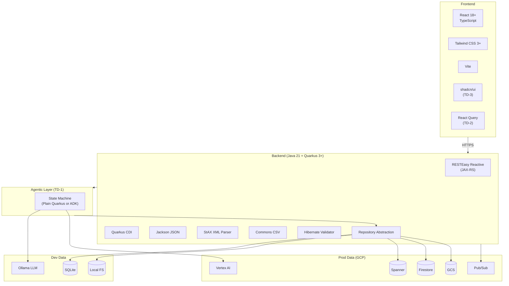
```mermaid
graph TB
    subgraph Frontend
        REACT["React 18+<br/>TypeScript"]
        TAILWIND["Tailwind CSS 3+"]
        VITE["Vite"]
        SHADCN["shadcn/ui<br/>(TD-3)"]
        RQ["React Query<br/>(TD-2)"]
    end

    subgraph Backend["Backend (Java 21 + Quarkus 3+)"]
        REST["RESTEasy Reactive<br/>(JAX-RS)"]
        CDI["Quarkus CDI"]
        JACK["Jackson JSON"]
        STAX["StAX XML Parser"]
        CSVP["Commons CSV"]
        HVAL["Hibernate Validator"]
        REPO_LAYER["Repository Abstraction"]
    end

    subgraph Agent["Agentic Layer (TD-1)"]
        SM["State Machine<br/>(Plain Quarkus or ADK)"]
    end

    subgraph Data_Dev["Dev Data"]
        SQLITE[("SQLite")]
        FS_LOCAL[("Local FS")]
        OLLAMA_T["Ollama LLM"]
    end

    subgraph Data_Prod["Prod Data (GCP)"]
        SPANNER[("Spanner")]
        FIRESTORE[("Firestore")]
        GCS_T[("GCS")]
        VERTEX["Vertex AI"]
        PUBSUB_T["Pub/Sub"]
    end

    Frontend -->|HTTPS| Backend
    Backend --> Agent
    Agent --> REPO_LAYER
    REPO_LAYER --> SQLITE
    REPO_LAYER --> FS_LOCAL
    REPO_LAYER --> SPANNER
    REPO_LAYER --> FIRESTORE
    REPO_LAYER --> GCS_T
    SM --> OLLAMA_T
    SM --> VERTEX
    Backend --> PUBSUB_T
```

---

### 2A.4 Impact on Existing Architecture Sections

> The shift from Python/FastAPI to Java/Quarkus affects several sections. The following callouts flag areas to update once TD decisions are locked in.

| Section | Current Assumption | Updated Reality | Action |
|---|---|---|---|
| 5.1 Frontend | React SPA (no CSS framework specified) | React + Tailwind + shadcn/ui (TD-3) | Update after TD-3 decided. |
| 5.11 LLM Integration | Python HTTP client | Quarkus REST Client Reactive (or LangChain4j — TD-4) | Update after TD-4 decided. |
| 6.4 SQLite Schema | Python dataclasses | Java records / POJOs + JDBC | Schema SQL stays the same; code examples need Java rewrite. |
| 6.5 Repository Abstraction | Python interfaces | Java interfaces + CDI `@Alternative` / `@IfBuildProfile` | Update class diagram. |
| 12.5 Environment Profiles | FastAPI, `config/dev.yaml` | Quarkus profiles (`application-dev.properties`) | Update config examples. |
| 15.2 CRM Schema | Python `@dataclass` | Java `record` classes | Rewrite as Java records once confirmed. |

---

## 3. System Context

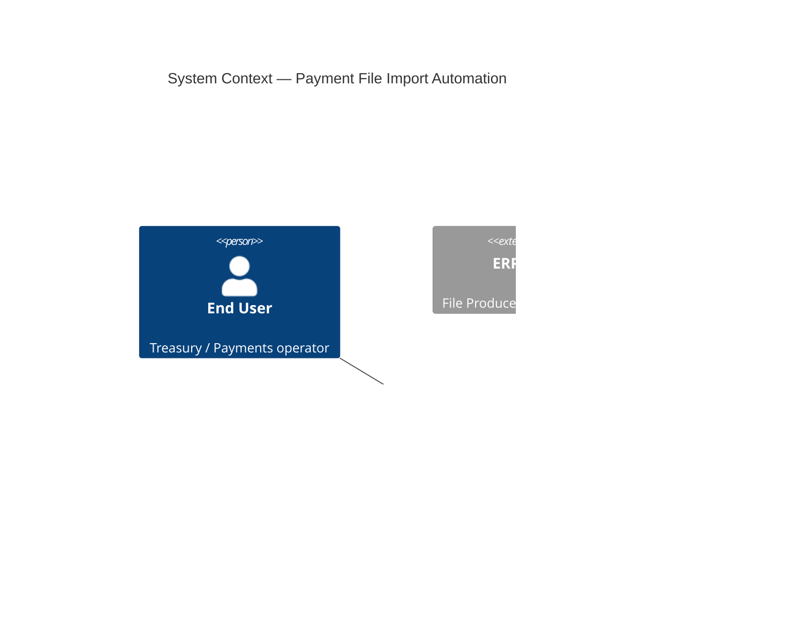
```mermaid
C4Context
    title System Context — Payment File Import Automation

    Person(user, "End User", "Treasury / Payments operator")
    System_Ext(erp, "ERP System", "File Producer (SAP, Oracle, etc.)")
    System_Ext(cbo, "Lloyds CBO Platform", "Payment Submission")

    System(importSys, "Payment File Import System", "GCP Cloud-Native")

    Rel(user, importSys, "Uploads files, reviews proposals, approves maps", "HTTPS")
    Rel(erp, importSys, "Produces payment files", "File Drop")
    Rel(importSys, cbo, "Submits validated BACS files", "CSV / XML")
```

### 3.1 External Actors

| Actor | Role | Interface |
|---|---|---|
| **End User** | Treasury / Payments operator. Uploads files, reviews proposals, approves maps. | React SPA via HTTPS. |
| **ERP System** | Produces non-standard payment-run CSV exports (SAP, Oracle, etc.) and fixed-length files. | File drop — files are uploaded by the user on behalf of the ERP. |
| **Lloyds CBO** | Consumes validated BACS CSV (`H/D/C/T`) and XML (`pain.001.001.03`) files. | Out-of-band upload to CBO portal (future: API integration). |

---

## 4. High-Level Architecture

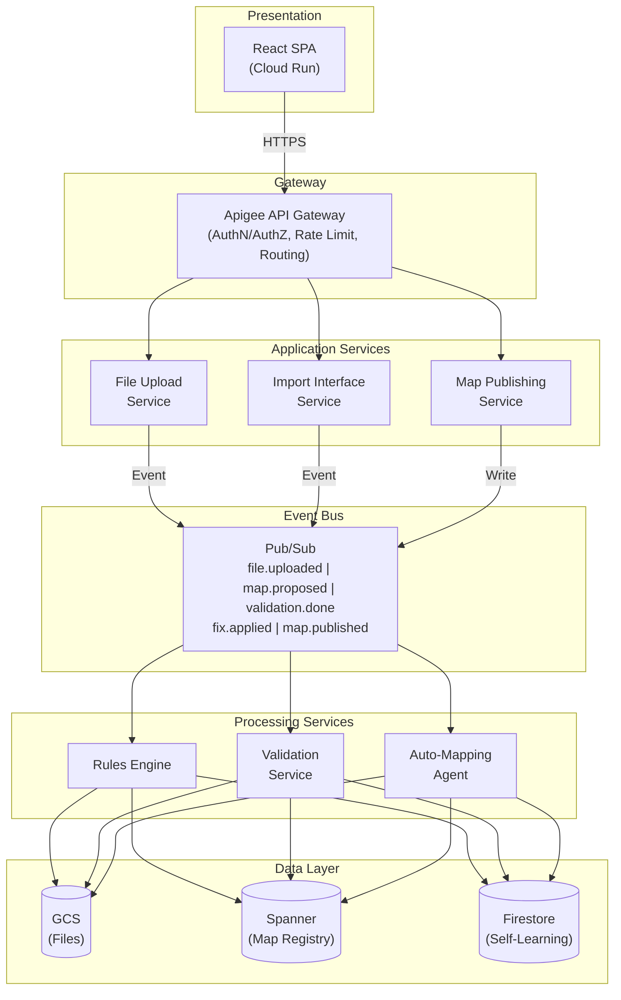
```mermaid
graph TB
    subgraph Presentation
        SPA["React SPA<br/>(Cloud Run)"]
    end

    subgraph Gateway
        APIGEE["Apigee API Gateway<br/>(AuthN/AuthZ, Rate Limit, Routing)"]
    end

    subgraph Application Services
        FUS["File Upload<br/>Service"]
        IIS["Import Interface<br/>Service"]
        MPS["Map Publishing<br/>Service"]
    end

    subgraph Processing Services
        RE["Rules Engine"]
        VS["Validation<br/>Service"]
        AMA["Auto-Mapping<br/>Agent"]
    end

    subgraph Event Bus
        PS["Pub/Sub<br/>file.uploaded | map.proposed | validation.done<br/>fix.applied | map.published"]
    end

    subgraph Data Layer
        GCS[("GCS<br/>(Files)")]
        SPANNER[("Spanner<br/>(Map Registry)")]
        FS[("Firestore<br/>(Self-Learning)")]
    end

    SPA -->|HTTPS| APIGEE
    APIGEE --> FUS
    APIGEE --> IIS
    APIGEE --> MPS
    FUS -->|Event| PS
    IIS -->|Event| PS
    MPS -->|Write| PS
    PS --> RE
    PS --> VS
    PS --> AMA
    RE --> GCS
    RE --> SPANNER
    RE --> FS
    VS --> GCS
    VS --> SPANNER
    VS --> FS
    AMA --> GCS
    AMA --> SPANNER
    AMA --> FS
```

---

## 5. Service Decomposition

### 5.1 Frontend — React SPA

| Attribute | Detail |
|---|---|
| **Runtime** | Cloud Run (static build served via nginx container) |
| **Responsibilities** | File upload UX; auto-map proposal table with confidence badges; self-learning indicators (per-field "Learned" / "Remembered" labels, system learning banner with accuracy trend); side-by-side source-to-target preview; inline validation errors with explainability panel; auto-fix before/after preview (including header sequence auto-increment); missing-field prompt flow; publish confirmation; import history view; real-time status (`processing` / `queued` / `complete` / `failed`). |
| **Auth** | OAuth 2.0 / OIDC token obtained from identity provider, passed as Bearer token to Apigee. |
| **Key Interactions** | All API calls routed through Apigee. WebSocket or SSE for real-time status updates. |

#### UI Component Inventory

| Component | Section Ref | Purpose |
|---|---|---|
| File Upload Panel | 12 | Drag-and-drop or file-select upload with progress indicator. |
| Auto-Map Proposal Table | 12 | Source column → Target field table with per-field confidence score. |
| Confidence Indicators | 12 | Visual badges (High / Medium / Low) per mapped field. |
| Source-to-Target Preview | 7.2 | Side-by-side rendering of raw source data ↔ mapped target fields. |
| Validation Results Panel | 12 | Line/field-level error list with reason, CBO category, and suggested fix. |
| Inline Fix Suggestions | 12 | Per-error actionable transform buttons; before/after diff view. |
| Missing-Field Prompt Dialog | 7.5 | Structured form for user-supplied values when source lacks mandatory fields. |
| Publish Confirmation Panel | 12 | Summary of map + transforms + validation results; explicit Approve / Reject. |
| Explainability Panel | 12 | "Why this failed" / "Why this fix is suggested" detail drawer. |
| Self-Learning Dashboard Banner | 12 | System learning status: imports learned from, corrections remembered, accuracy trend. |
| Mapping Learning Indicators | 12 | Per-field "🧠 Learned" and "🔄 Remembered" labels showing mapping memory. |
| Import History View | 12 | Paginated table of prior imports with status, failure reasons, and map reuse. |
| Agent Prompt Panel | 12 | Clarification requests from the Auto-Mapping Agent to the user. |

---

### 5.2 Apigee API Gateway

| Attribute | Detail |
|---|---|
| **Responsibilities** | Authentication (OAuth token validation); authorization (tenant scope, payment-type entitlement); rate limiting and quota enforcement; request routing to backend services; correlation ID injection (`X-Correlation-Id`); request/response logging. |
| **Tenant Isolation** | Every request is scoped to a tenant via the validated token's `tenant_id` claim. Apigee policies enforce that downstream calls carry the correct tenant context. |
| **Quota Policies** | Concurrent import limit per tenant; requests-per-minute cap; file-size pre-check before forwarding. |

---

### 5.3 File Upload Service

| Attribute | Detail |
|---|---|
| **Runtime** | Cloud Run (autoscaling, min 0) |
| **Responsibilities** | Accept file upload (multipart); validate file size limits (CSV ≤ 0.5 MB, XML ≤ 6 MB); generate file fingerprint (SHA-256 over content); stage the file in GCS under a tenant-scoped prefix; publish `file.uploaded` event to Pub/Sub; return upload receipt with `file_id` and `fingerprint`. |
| **Inputs** | Raw file bytes + metadata (tenant, file name, declared type). |
| **Outputs** | Upload receipt JSON; file staged in GCS; `file.uploaded` Pub/Sub message. |
| **Idempotency** | Duplicate uploads (same fingerprint + tenant within a configurable window) return the existing `file_id` without re-processing. |

#### GCS Bucket Layout

```
gs://{project}-import-staging/
  └── {tenant_id}/
        └── {file_id}/
              ├── original/        ← raw uploaded file
              ├── parsed/          ← intermediate parsed representation
              ├── validated/       ← post-validation snapshot
              └── output/          ← final converted BACS CSV / XML
```

---

### 5.4 Import Interface Service

| Attribute | Detail |
|---|---|
| **Runtime** | Cloud Run (autoscaling) |
| **Trigger** | Pub/Sub subscription: `file.uploaded` |
| **Responsibilities** | Detect file type (CSV vs XML vs fixed-length) and subtype (CBO H/D/C/T vs ERP vs Standard 18); detect delimiter, encoding, header row, record structure; parse file into an internal canonical record model; invoke the Rules Engine for schema inference and auto-map proposal; check entry count limits per type; validate sequence number uniqueness within 24-hour window (CSV header sequences — see Pain Point #4); assemble the proposed map with per-field confidence; publish `map.proposed` event with the proposal payload; persist intermediate parsed state to GCS (`parsed/`). |
| **Sub-Components** | File Type Detector; CSV Parser; XML Parser; Fixed-Length Parser; Schema Inference Engine (delegates to Rules Engine). |

#### File Type Detection Strategy

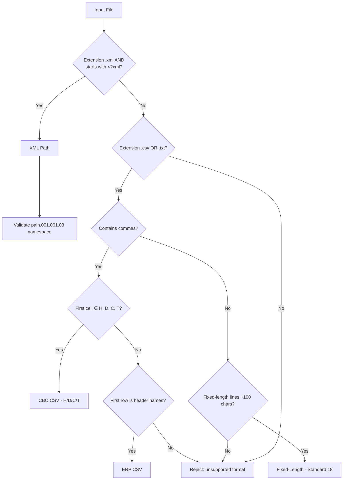
```mermaid
flowchart TD
    A[Input File] --> B{Extension .xml AND<br/>starts with &lt;?xml?}
    B -->|Yes| C[XML Path]
    C --> C1[Validate pain.001.001.03 namespace]
    B -->|No| D{Extension .csv OR .txt?}
    D -->|Yes| E{Contains commas?}
    E -->|Yes| F{First cell ∈ H, D, C, T?}
    F -->|Yes| G[CBO CSV - H/D/C/T]
    F -->|No| H{First row is header names?}
    H -->|Yes| I[ERP CSV]
    H -->|No| J[Reject: unsupported format]
    E -->|No| K{Fixed-length lines ~100 chars?}
    K -->|Yes| L[Fixed-Length - Standard 18]
    K -->|No| J
    D -->|No| J
```

#### Entry Count Enforcement

| Payment Type | Max Entries | Action on Exceed |
|---|---|---|
| Single-debit Bacs | 1,250 | Reject at intake with `VR-FILE-003` |
| Inter-account transfers | 500 | Reject at intake |
| All other types | 2,500 | Reject at intake |

---

### 5.5 Rules Engine

| Attribute | Detail |
|---|---|
| **Runtime** | Cloud Run (autoscaling) |
| **Invocation** | Synchronous gRPC call from Import Interface Service and Validation Service. |
| **Responsibilities** | Load and cache the rule registry from YAML config at startup; evaluate rules against parsed records; produce structured rule-match results (pass / fail / warn); maintain deterministic transform definitions; compute per-field confidence scores based on pattern-match strength and rule outcomes; query Firestore for historical rule scores and map success rates to refine confidence. |
| **Rule Storage** | All 85 validation rules are declared in `config/rules/validation-rules.yaml`. All 22 transforms are declared in `config/rules/transforms.yaml`. **Zero hardcoded rules in Java.** Rules are loaded at startup by `YamlRuleRegistry` and cached in memory. Hot-reload is supported via a `POST /api/rules/reload` admin endpoint. |
| **Self-Learning Integration** | Reads from Firestore: `rule_scores` (success/failure counters), `mapping_outcomes` (historical fingerprint-to-map success). |
| **Extensibility** | New rules are added by appending to `validation-rules.yaml` with a new `evaluator` key. If the evaluator type already exists, no Java code is needed. New evaluator types require a single class implementing the `RuleEvaluator` interface (OCP — Open/Closed Principle). Canary rollout is achieved by setting `enabled: false` on new rules and toggling per environment. |

#### YAML-Driven Rule Architecture (AP-10, AP-11, AP-14)

```
config/rules/
├── validation-rules.yaml    # 85 rules — categories, severity, evaluator keys, parameters
└── transforms.yaml          # 22 transforms — transformer keys, parameters, linked rules
```

**Design Pattern: Strategy + Factory**

Each rule in YAML declares an `evaluator` key (e.g., `file-size`, `date-format`, `mandatory-field`). At startup, `EvaluatorFactory` resolves each key to a concrete `RuleEvaluator` implementation via CDI `@Named` lookup. This means:

- **Adding a new rule of an existing type** (e.g., another `max-length` check) = YAML-only change
- **Adding a new rule type** = one new `RuleEvaluator` class + YAML entry
- **Disabling/enabling a rule** = set `enabled: false` in YAML
- **Changing thresholds/patterns** = edit `parameters` in YAML

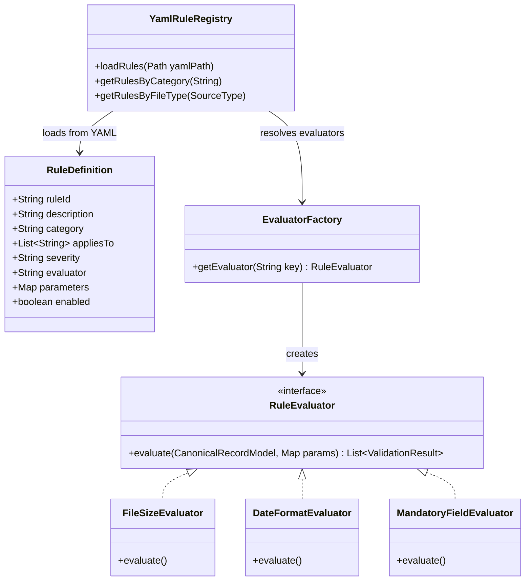
```mermaid
classDiagram
    class RuleDefinition {
        +String ruleId
        +String description
        +String category
        +List~String~ appliesTo
        +String severity
        +String evaluator
        +Map parameters
        +boolean enabled
    }
    class RuleEvaluator {
        <<interface>>
        +evaluate(CanonicalRecordModel, Map params) List~ValidationResult~
    }
    class FileSizeEvaluator {
        +evaluate()
    }
    class DateFormatEvaluator {
        +evaluate()
    }
    class MandatoryFieldEvaluator {
        +evaluate()
    }
    class EvaluatorFactory {
        +getEvaluator(String key) RuleEvaluator
    }
    class YamlRuleRegistry {
        +loadRules(Path yamlPath)
        +getRulesByCategory(String)
        +getRulesByFileType(SourceType)
    }
    RuleEvaluator <|.. FileSizeEvaluator
    RuleEvaluator <|.. DateFormatEvaluator
    RuleEvaluator <|.. MandatoryFieldEvaluator
    EvaluatorFactory --> RuleEvaluator : creates
    YamlRuleRegistry --> RuleDefinition : loads from YAML
    YamlRuleRegistry --> EvaluatorFactory : resolves evaluators
```

**Evaluator Types** (~20 reusable evaluator classes cover all 85 rules):

| Evaluator Key | Rules Using It | Description |
|---|---|---|
| `file-size` | VR-FILE-001, VR-FILE-002 | Check file byte size against `maxBytes` parameter |
| `entry-count` | VR-FILE-003 | Check payment entry count against `maxEntries` |
| `encoding-check` | VR-FILE-004 | Verify encoding and BOM presence |
| `xml-declaration` | VR-FILE-005 | Check XML declaration attributes |
| `xsd-validation` | VR-FILE-006 | Validate against XSD schema |
| `delimiter-check` | VR-FILE-007 | Verify CSV delimiter character |
| `record-count` | VR-STRUCT-001, VR-STRUCT-002 | Count specific record types at expected positions |
| `record-sequence` | VR-STRUCT-003, VR-STRUCT-004 | Validate record ordering |
| `xml-element-count` | VR-STRUCT-006, VR-STRUCT-007 | Count XML elements by path |
| `mandatory-field` | VR-SEQ-001, VR-DBT-001, VR-BEN-001/003/006, VR-XML-008/009 | Check field presence |
| `pattern-match` | VR-SEQ-003 | Regex pattern validation |
| `date-format` | VR-DATE-001/002/003, VR-FLT-004 | Validate and detect date formats |
| `numeric-range` | VR-AMT-001 | Check numeric bounds |
| `forbidden-chars` | VR-AMT-004, VR-AMT-005 | Detect forbidden characters in fields |
| `exact-length` | VR-DBT-003/004, VR-BEN-002/004, VR-FLT-005/006 | Validate exact field length |
| `max-length` | VR-DBT-006, VR-BEN-007/009 | Validate maximum field length |
| `charset-validation` | VR-BEN-008, VR-BEN-011 | Validate against allowed character set |
| `fixed-value` | VR-XML-001/002/003 | Check field equals expected constant |
| `empty-element` | VR-XML-005/006/007 | Check XML element is self-closing |
| `conditional-subtree` | VR-XML-010/011 | Check subtree presence based on condition |

#### Rule Evaluation Pipeline

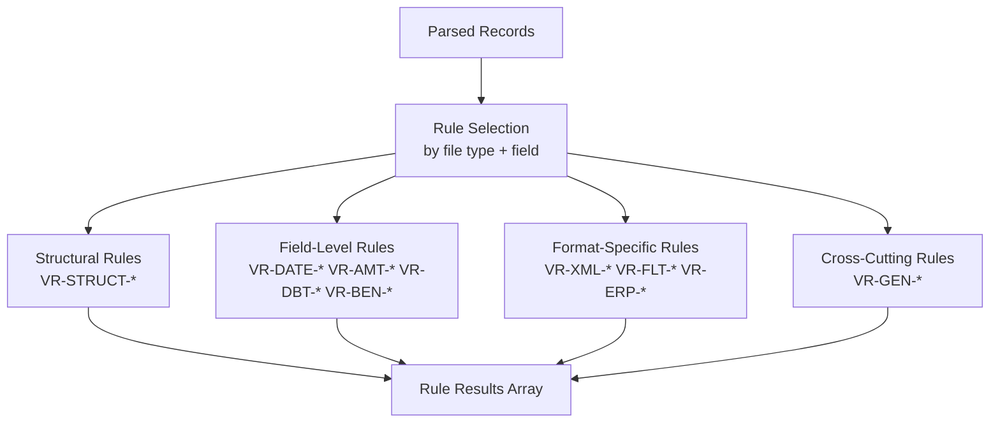
```mermaid
flowchart TD
    A[Parsed Records] --> B[Rule Selection<br/>by file type + field]
    B --> C[Structural Rules<br/>VR-STRUCT-*]
    B --> D[Field-Level Rules<br/>VR-DATE-* VR-AMT-* VR-DBT-* VR-BEN-*]
    B --> E[Format-Specific Rules<br/>VR-XML-* VR-FLT-* VR-ERP-*]
    B --> F[Cross-Cutting Rules<br/>VR-GEN-*]
    C --> G[Rule Results Array]
    D --> G
    E --> G
    F --> G
```

---

### 5.6 Validation Service

| Attribute | Detail |
|---|---|
| **Runtime** | Cloud Run (autoscaling) |
| **Trigger** | Synchronous API call from frontend ("one-click validation") via Apigee; also invoked internally after each auto-fix batch. |
| **Responsibilities** | Execute the full rule set (via Rules Engine) against the current map + parsed data; for XML: validate against `pain.001.001.03` XSD; enforce empty-element tag rules, conditional tag removal, fixed-value fields; produce structured error JSON with location, reason, CBO error category, and suggested transforms; return validation summary (pass / fail / warn counts). |
| **Response Target** | ≤ 5 seconds for standard payload (≤ 1,250 entries). |

#### Validation Error Response Schema

```json
{
  "correlationId": "string",
  "fileId": "string",
  "status": "PASS | FAIL | WARN",
  "summary": {
    "totalRulesEvaluated": 85,
    "errors": 4,
    "warnings": 8,
    "passed": 73
  },
  "errors": [
    {
      "ruleId": "VR-BEN-002",
      "severity": "ERROR",
      "location": {
        "type": "ROW | TAG | POSITION",
        "row": 5,
        "column": "D",
        "tagPath": null,
        "position": null
      },
      "message": "Beneficiary account number must be exactly 8 digits",
      "cboCategory": "BENEFICIARY",
      "currentValue": "1234567",
      "autoFixable": true,
      "suggestedFix": {
        "transformId": "TF-LEADING-ZERO-PAD",
        "description": "Left-pad with zeros to 8 digits",
        "previewValue": "01234567"
      }
    }
  ]
}
```

---

### 5.7 Auto-Fix Engine

| Attribute | Detail |
|---|---|
| **Runtime** | Embedded within the Auto-Mapping Agent (Cloud Run) |
| **Invocation** | Triggered after validation returns fixable errors; operates in a loop. |
| **Responsibilities** | Apply only approved deterministic transforms from `config/rules/transforms.yaml`; re-invoke Validation Service after each batch; produce before/after diff per record; stop when: validation passes, no safe transforms remain, or retry threshold (configurable, default 3 iterations) is reached. **Zero hardcoded transforms.** |
| **Transform Storage** | All 22 transforms are declared in `config/rules/transforms.yaml`. Each entry specifies a `transformer` key resolved by `TransformerFactory` (Strategy pattern), parameters, and linked rule IDs. |

#### YAML-Driven Transform Architecture

Mirrors the rule architecture: each transform in YAML declares a `transformer` key. `TransformerFactory` resolves it to a concrete `Transformer` implementation via CDI `@Named` lookup. ~10 reusable transformer classes cover all 22 transforms.

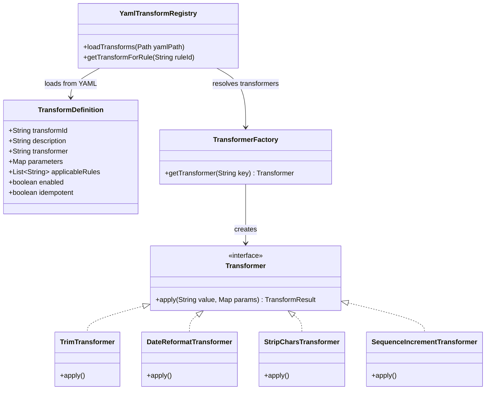
```mermaid
classDiagram
    class TransformDefinition {
        +String transformId
        +String description
        +String transformer
        +Map parameters
        +List~String~ applicableRules
        +boolean enabled
        +boolean idempotent
    }
    class Transformer {
        <<interface>>
        +apply(String value, Map params) TransformResult
    }
    class TrimTransformer {
        +apply()
    }
    class DateReformatTransformer {
        +apply()
    }
    class StripCharsTransformer {
        +apply()
    }
    class SequenceIncrementTransformer {
        +apply()
    }
    class TransformerFactory {
        +getTransformer(String key) Transformer
    }
    class YamlTransformRegistry {
        +loadTransforms(Path yamlPath)
        +getTransformForRule(String ruleId)
    }
    Transformer <|.. TrimTransformer
    Transformer <|.. DateReformatTransformer
    Transformer <|.. StripCharsTransformer
    Transformer <|.. SequenceIncrementTransformer
    TransformerFactory --> Transformer : creates
    YamlTransformRegistry --> TransformDefinition : loads from YAML
    YamlTransformRegistry --> TransformerFactory : resolves transformers
```

#### Transform Allowlist (from `config/rules/transforms.yaml`)

| Transform ID | Description | Applicable Rules |
|---|---|---|
| TF-TRIM | Trim leading/trailing whitespace | VR-GEN-001 |
| TF-DATE-REFORMAT | Convert between known date formats | VR-DATE-001 to VR-DATE-004, VR-DATE-006, VR-ERP-004 |
| TF-YEAR-WINDOW | Expand 2-digit year via century-windowing | VR-DATE-006 |
| TF-STRIP-COMMA | Remove commas from numeric amounts | VR-AMT-004 |
| TF-STRIP-SYMBOL | Remove currency symbols | VR-AMT-005 |
| TF-PENCE-TO-POUNDS | Divide integer pence by 100 | VR-AMT-006 |
| TF-ADD-DECIMAL | Append `.00` to whole-number amounts | VR-AMT-002 |
| TF-LEADING-ZERO-PAD | Left-pad sort codes (6) and account numbers (8) | VR-GEN-002, VR-GEN-003, VR-BEN-002, VR-BEN-004 |
| TF-STRIP-DASH | Remove dashes from sort codes | VR-BEN-004 |
| TF-DEBIT-COMPOSITE | Merge sort code + account into SSSSSS-AAAAAAAA | VR-DBT-002 |
| TF-XML-FIXED-VALUE | Set MsgId, PmtMtd, Prtry to required constants | VR-XML-001 to VR-XML-003 |
| TF-XML-EMPTY-ELEMENT | Replace populated elements with self-closing empty tags | VR-XML-005 to VR-XML-007 |
| TF-XML-PRUNE-SUBTREE | Remove parent subtree when optional child is omitted | VR-XML-010, VR-XML-011, VR-XML-012 |
| TF-XML-AUTO-COUNT | Recalculate NbOfTxs from transaction count | VR-XML-004 |
| TF-STRIP-BOM | Remove UTF-8 BOM prefix | VR-FILE-004 |
| TF-XML-STANDALONE | Replace standalone="true" with standalone="yes" | VR-FILE-005 |
| TF-STRIP-INVALID-CHARS | Remove characters outside the valid BACS character set | VR-BEN-008, VR-BEN-011 |
| TF-CURRENCY-ATTR | Set XML Ccy attribute to ISO 4217 code (default GBP) | VR-AMT-007, VR-AMT-008 |
| TF-CLEAR-RESERVED | Clear contents of reserved columns | VR-DBT-008 |
| TF-SKIP-HEADER-ROW | Exclude header row from payment data extraction | VR-ERP-001 |
| TF-SKIP-COLUMNS | Exclude non-payment columns from mapping | VR-ERP-002 |
| TF-SEQ-INCREMENT | Auto-generate next available unique header sequence number (queries `sequence_numbers` table for 24-hour window and increments) | VR-HT-001 |

#### Auto-Fix Loop Flow

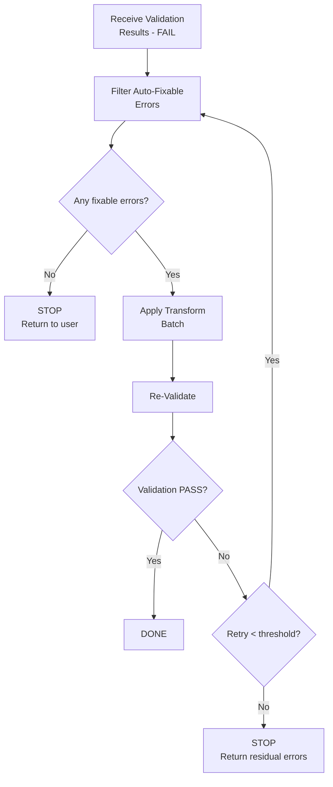
```mermaid
flowchart TD
    A[Receive Validation<br/>Results - FAIL] --> B[Filter Auto-Fixable<br/>Errors]
    B --> C{Any fixable errors?}
    C -->|No| D[STOP<br/>Return to user]
    C -->|Yes| E[Apply Transform<br/>Batch]
    E --> F[Re-Validate]
    F --> G{Validation PASS?}
    G -->|Yes| H[DONE]
    G -->|No| I{Retry < threshold?}
    I -->|No| J[STOP<br/>Return residual errors]
    I -->|Yes| B
```

---

### 5.8 Auto-Mapping Agent (Orchestrator)

| Attribute | Detail |
|---|---|
| **Runtime** | Cloud Run (autoscaling) |
| **Role** | Central orchestrator for the end-to-end import pipeline. |
| **Responsibilities** | Coordinate the sequence: parse → infer → propose → validate → auto-fix loop → prompt user → publish; manage workflow state (persisted per import session); query Map Registry for reusable maps based on fingerprint similarity and historical success; surface clarification prompts to user via the frontend (missing fields, ambiguous dates, etc.); invoke Map Publishing Service upon user approval. |

#### Orchestration State Machine

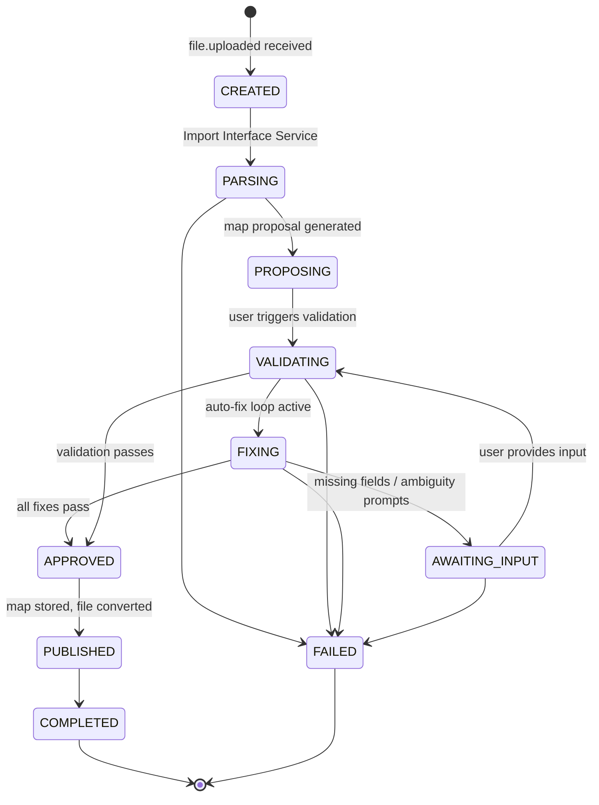
```mermaid
stateDiagram-v2
    [*] --> CREATED: file.uploaded received
    CREATED --> PARSING: Import Interface Service
    PARSING --> PROPOSING: map proposal generated
    PROPOSING --> VALIDATING: user triggers validation
    VALIDATING --> FIXING: auto-fix loop active
    FIXING --> AWAITING_INPUT: missing fields / ambiguity prompts
    FIXING --> APPROVED: all fixes pass
    AWAITING_INPUT --> VALIDATING: user provides input
    VALIDATING --> APPROVED: validation passes
    APPROVED --> PUBLISHED: map stored, file converted
    PUBLISHED --> COMPLETED
    PARSING --> FAILED
    VALIDATING --> FAILED
    FIXING --> FAILED
    AWAITING_INPUT --> FAILED
    COMPLETED --> [*]
    FAILED --> [*]
```

---

### 5.9 Map Publishing Service

| Attribute | Detail |
|---|---|
| **Runtime** | Cloud Run (autoscaling) |
| **Trigger** | API call from Auto-Mapping Agent after user approval. |
| **Responsibilities** | Persist the approved map definition, version, lineage, and metadata to Spanner (Map Registry); generate the final BACS output file (CSV or XML) using the approved map; store the output file in GCS (`output/`); record user-supplied supplemental values as part of the map; publish `map.published` event for downstream consumption; update Firestore self-learning counters (success for all rules/transforms used). |

#### Publish Payload Structure

```json
{
  "mapName": "string",
  "mapVersion": 1,
  "fileId": "string",
  "fingerprint": "sha256:abc123...",
  "tenantId": "string",
  "sourceType": "ERP_CSV | CBO_CSV | FIXED_LENGTH | XML",
  "targetType": "BACS_CSV | BACS_XML",
  "definition": {
    "fieldMappings": [
      {
        "sourceField": "Payment Bank Account",
        "sourceLocation": "column:E",
        "targetField": "beneficiary_account_number",
        "targetLocation": "C:D",
        "confidence": 0.95,
        "transformsApplied": []
      }
    ],
    "supplementalValues": {
      "debit_account": "123456-12345678"
    }
  },
  "transformsApplied": ["TF-DATE-REFORMAT", "TF-SKIP-COLUMNS"],
  "validationSummary": { "errors": 0, "warnings": 1, "passed": 84 },
  "createdBy": "user@tenant.com",
  "createdAt": "2026-02-26T14:30:00.000Z"
}
```

---

### 5.10 Self-Learning Service

| Attribute | Detail |
|---|---|
| **Runtime** | Passive — data written by Map Publishing Service and Validation Service; read by Rules Engine, Auto-Mapping Agent, and Frontend. |
| **Storage** | Firestore (document DB, low-latency reads). |
| **Responsibilities** | Track per-rule success/failure counters; track per-transform effectiveness; track mapping success by fingerprint and context; promote high-performing rules (increase confidence weight); demote error-prone rules; recommend reusable maps based on fingerprint similarity and historical success; **track user corrections** (field-level mapping overrides) and persist them as learned patterns for future proposals; **compute mapping accuracy metrics** (aggregate success rate across imports, trending over time); **expose learning state** to the Frontend via API for Dashboard learning banner and per-field learning indicators. |
| **No ML Training** | Self-learning is purely counter/heuristic-based (per requirements §8.6). |
| **Pain Point #7 (Self-Learning) Coverage** | User corrections are stored in `mapping_corrections` records linked to fingerprint + field pair. On subsequent imports with matching fingerprints, the Auto-Mapping Agent applies remembered corrections automatically, boosting confidence to 1.0 for those fields. The Frontend displays "🧠 Learned" (confirmed by N imports) and "🔄 Remembered" (user-corrected, now automatic) indicators per mapping row. The Dashboard shows an aggregate learning banner with accuracy trend. |

#### Self-Learning Data Model

| Entity | Key Fields | Purpose |
|---|---|---|
| `rule_scores` | rule_id, attempt_count, success_count, failure_count | Per-rule effectiveness tracking |
| `mapping_corrections` | fingerprint, source_field, target_field, correction_count, last_corrected | Remembered user corrections per field |
| `learning_metrics` | tenant_id, total_imports, total_corrections, accuracy_current, accuracy_initial | Aggregate accuracy metrics for Dashboard banner |

---

### 5.11 LLM Integration Service (Schema Inference Assistant)

| Attribute | Detail |
|---|---|
| **Role** | Provides natural-language-assisted schema inference for ambiguous column mappings, beneficiary name interpretation, and auto-fix suggestion explanations. The LLM augments (does not replace) the deterministic Rules Engine — it is consulted only when rule-based confidence is below a configurable threshold (default: 0.6). |
| **Runtime — Dev** | **Ollama** running locally on the developer's machine. Model served via Ollama's OpenAI-compatible REST API (`http://localhost:11434/v1`). |
| **Runtime — Prod** | Vertex AI (Gemini) or Cloud Run-hosted model endpoint behind IAM auth. |
| **Interface** | OpenAI-compatible Chat Completions API (`/v1/chat/completions`). Both Ollama (dev) and Vertex AI (prod) expose this contract, so the calling code is identical across environments. |
| **Model Selection — Dev** | Default: `mistral` or `llama3` via Ollama (fits in 8 GB RAM). Override via `LLM_MODEL` env var. |
| **Model Selection — Prod** | `gemini-1.5-flash` (or upgraded as available). Override via `LLM_MODEL` env var. |
| **Invocation Points** | 1. **Column-to-field mapping** — when the Rules Engine pattern dictionary returns confidence < threshold for a source column, the LLM is asked to classify the column header + sample values against the BACS target schema. 2. **Ambiguity resolution** — date format disambiguation (`DD/MM` vs `MM/DD`), composite field splitting. 3. **Explainability text** — generate human-readable "why" descriptions for validation errors and auto-fix suggestions. |
| **Guardrails** | LLM output is **never applied directly**. Every LLM suggestion is re-validated through the deterministic Rules Engine before being surfaced to the user. Hallucinated field names or invalid transforms are filtered out. |
| **Timeout** | 15 s per call (dev); 5 s per call (prod). Timeout → fall back to rule-only confidence. |
| **Configuration** | Environment variable `LLM_BASE_URL` controls the endpoint. `LLM_API_KEY` is required for prod (Vertex AI); empty/absent for Ollama dev. |

#### LLM Call Flow

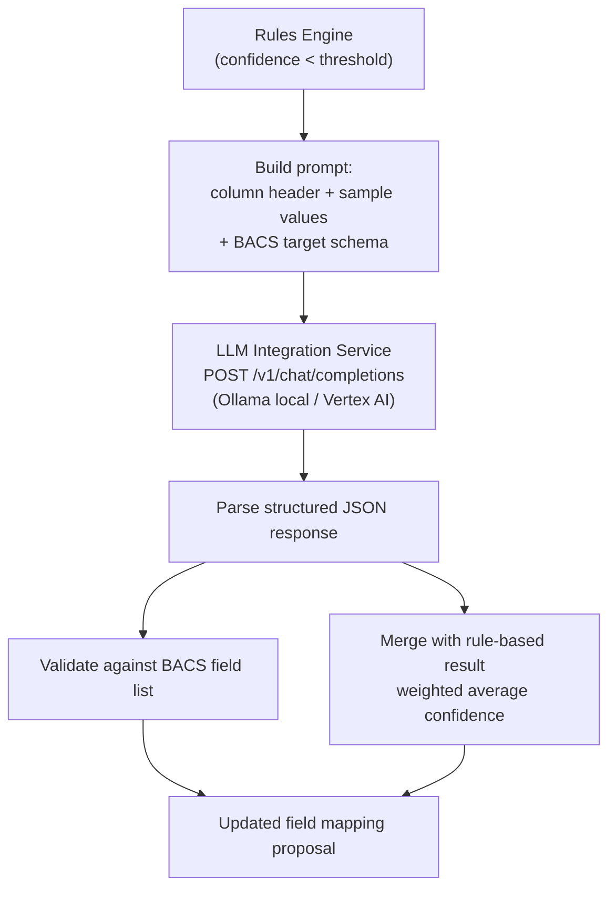
```mermaid
flowchart TD
    A["Rules Engine<br/>(confidence < threshold)"] --> B[Build prompt:<br/>column header + sample values<br/>+ BACS target schema]
    B --> C["LLM Integration Service<br/>POST /v1/chat/completions<br/>(Ollama local / Vertex AI)"]
    C --> D[Parse structured JSON response]
    D --> E[Validate against BACS field list]
    D --> F[Merge with rule-based result<br/>weighted average confidence]
    E --> G[Updated field mapping proposal]
    F --> G
```

#### Environment Configuration

| Variable | Dev (Local) | Prod (GCP) |
|---|---|---|
| `LLM_BASE_URL` | `http://localhost:11434/v1` | `https://{region}-aiplatform.googleapis.com/v1/projects/{project}/locations/{region}/endpoints/{endpoint}` |
| `LLM_MODEL` | `mistral` (or `llama3`) | `gemini-1.5-flash` |
| `LLM_API_KEY` | *(empty — Ollama needs no key)* | Service account token (Workload Identity) |
| `LLM_TIMEOUT_MS` | `15000` | `5000` |
| `LLM_CONFIDENCE_THRESHOLD` | `0.6` | `0.6` |

---

## 6. Data Architecture

### 6.1 Storage Technology Mapping

| Data Category | Prod (GCP) | Dev (Local) | Justification |
|---|---|---|---|
| Uploaded files, parsed intermediates, output files | **GCS** | **Local filesystem** (`./data/storage/`) | GCS in prod; simple directory tree in dev. |
| Map definitions, versions, lineage | **Spanner** | **SQLite** (`./data/import.db`) | Spanner for global consistency in prod; SQLite for zero-dependency local dev. |
| Self-learning counters, rule scores, mapping corrections, learning metrics | **Firestore** | **SQLite** (`./data/import.db`) | Firestore in prod; same SQLite file in dev (single-process is fine locally). |
| Import session state, workflow status | **Firestore** | **SQLite** (`./data/import.db`) | Same pattern. |
| Sequence number tracking (24-hour window) | **Firestore** | **SQLite** (`./data/import.db`) | TTL enforced by application-level query (`WHERE imported_at > now - 24h`). |

### 6.2 Entity-Relationship Model

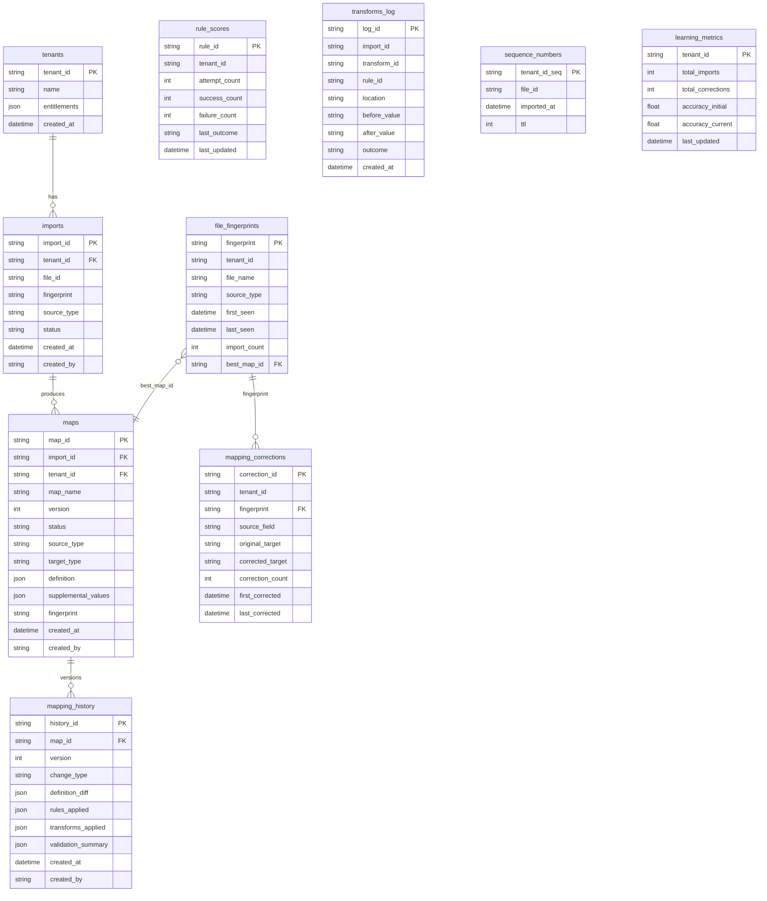
```mermaid
erDiagram
    tenants {
        string tenant_id PK
        string name
        json entitlements
        datetime created_at
    }
    imports {
        string import_id PK
        string tenant_id FK
        string file_id
        string fingerprint
        string source_type
        string status
        datetime created_at
        string created_by
    }
    maps {
        string map_id PK
        string import_id FK
        string tenant_id FK
        string map_name
        int version
        string status
        string source_type
        string target_type
        json definition
        json supplemental_values
        string fingerprint
        datetime created_at
        string created_by
    }
    mapping_history {
        string history_id PK
        string map_id FK
        int version
        string change_type
        json definition_diff
        json rules_applied
        json transforms_applied
        json validation_summary
        datetime created_at
        string created_by
    }
    file_fingerprints {
        string fingerprint PK
        string tenant_id
        string file_name
        string source_type
        datetime first_seen
        datetime last_seen
        int import_count
        string best_map_id FK
    }
    rule_scores {
        string rule_id PK
        string tenant_id
        int attempt_count
        int success_count
        int failure_count
        string last_outcome
        datetime last_updated
    }
    transforms_log {
        string log_id PK
        string import_id
        string transform_id
        string rule_id
        string location
        string before_value
        string after_value
        string outcome
        datetime created_at
    }
    sequence_numbers {
        string tenant_id_seq PK
        string file_id
        datetime imported_at
        int ttl
    }
    mapping_corrections {
        string correction_id PK
        string tenant_id
        string fingerprint FK
        string source_field
        string original_target
        string corrected_target
        int correction_count
        datetime first_corrected
        datetime last_corrected
    }
    learning_metrics {
        string tenant_id PK
        int total_imports
        int total_corrections
        float accuracy_initial
        float accuracy_current
        datetime last_updated
    }

    tenants ||--o{ imports : "has"
    imports ||--o{ maps : "produces"
    maps ||--o{ mapping_history : "versions"
    file_fingerprints }o--|| maps : "best_map_id"
    file_fingerprints ||--o{ mapping_corrections : "fingerprint"
```

### 6.3 Spanner Schema (Map Registry)

```sql
CREATE TABLE maps (
    map_id       STRING(36) NOT NULL,
    import_id    STRING(36) NOT NULL,
    tenant_id    STRING(36) NOT NULL,
    map_name     STRING(255),
    version      INT64 NOT NULL,
    status       STRING(20) NOT NULL,  -- DRAFT | PUBLISHED | ARCHIVED
    source_type  STRING(20) NOT NULL,  -- ERP_CSV | CBO_CSV | FIXED_LENGTH | XML
    target_type  STRING(20) NOT NULL,  -- BACS_CSV | BACS_XML
    definition   JSON NOT NULL,
    supplemental_values JSON,
    fingerprint  STRING(64),
    validation_summary JSON,
    created_at   TIMESTAMP NOT NULL OPTIONS (allow_commit_timestamp = true),
    updated_at   TIMESTAMP NOT NULL OPTIONS (allow_commit_timestamp = true),
    created_by   STRING(255) NOT NULL,
) PRIMARY KEY (tenant_id, map_id);

CREATE INDEX maps_by_fingerprint
    ON maps (tenant_id, fingerprint, status);

CREATE INDEX maps_by_status
    ON maps (tenant_id, status, updated_at DESC);

CREATE TABLE mapping_history (
    history_id      STRING(36) NOT NULL,
    map_id          STRING(36) NOT NULL,
    tenant_id       STRING(36) NOT NULL,
    version         INT64 NOT NULL,
    change_type     STRING(20) NOT NULL, -- CREATED | UPDATED | PUBLISHED | ARCHIVED
    definition_diff JSON,
    rules_applied   ARRAY<STRING(50)>,
    transforms_applied ARRAY<STRING(50)>,
    validation_summary JSON,
    created_at      TIMESTAMP NOT NULL OPTIONS (allow_commit_timestamp = true),
    created_by      STRING(255) NOT NULL,
) PRIMARY KEY (tenant_id, map_id, history_id),
  INTERLEAVE IN PARENT maps ON DELETE CASCADE;

CREATE TABLE file_fingerprints (
    fingerprint  STRING(64) NOT NULL,
    tenant_id    STRING(36) NOT NULL,
    file_name    STRING(255),
    source_type  STRING(20),
    first_seen   TIMESTAMP NOT NULL,
    last_seen    TIMESTAMP NOT NULL,
    import_count INT64 NOT NULL DEFAULT (0),
    best_map_id  STRING(36),
) PRIMARY KEY (tenant_id, fingerprint);
```

### 6.4 SQLite Schema (Local Development)

The SQLite schema mirrors the Spanner schema with SQLite-compatible types. A shared repository abstraction layer exposes identical CRUD operations regardless of backend.

```sql
-- SQLite schema: ./data/import.db

CREATE TABLE IF NOT EXISTS maps (
    map_id           TEXT NOT NULL,
    import_id        TEXT NOT NULL,
    tenant_id        TEXT NOT NULL DEFAULT 'local',
    map_name         TEXT,
    version          INTEGER NOT NULL DEFAULT 1,
    status           TEXT NOT NULL DEFAULT 'DRAFT',  -- DRAFT | PUBLISHED | ARCHIVED
    source_type      TEXT NOT NULL,                   -- ERP_CSV | CBO_CSV | FIXED_LENGTH | XML
    target_type      TEXT NOT NULL,                   -- BACS_CSV | BACS_XML
    definition       TEXT NOT NULL,                   -- JSON string
    supplemental_values TEXT,                         -- JSON string
    fingerprint      TEXT,
    validation_summary TEXT,                          -- JSON string
    created_at       TEXT NOT NULL DEFAULT (datetime('now')),
    updated_at       TEXT NOT NULL DEFAULT (datetime('now')),
    created_by       TEXT NOT NULL DEFAULT 'local-dev',
    PRIMARY KEY (tenant_id, map_id)
);

CREATE INDEX IF NOT EXISTS idx_maps_fingerprint
    ON maps (tenant_id, fingerprint, status);

CREATE INDEX IF NOT EXISTS idx_maps_status
    ON maps (tenant_id, status, updated_at DESC);

CREATE TABLE IF NOT EXISTS mapping_history (
    history_id         TEXT NOT NULL,
    map_id             TEXT NOT NULL,
    tenant_id          TEXT NOT NULL DEFAULT 'local',
    version            INTEGER NOT NULL,
    change_type        TEXT NOT NULL,
    definition_diff    TEXT,           -- JSON string
    rules_applied      TEXT,           -- JSON array string
    transforms_applied TEXT,           -- JSON array string
    validation_summary TEXT,           -- JSON string
    created_at         TEXT NOT NULL DEFAULT (datetime('now')),
    created_by         TEXT NOT NULL DEFAULT 'local-dev',
    PRIMARY KEY (tenant_id, map_id, history_id),
    FOREIGN KEY (tenant_id, map_id) REFERENCES maps (tenant_id, map_id) ON DELETE CASCADE
);

CREATE TABLE IF NOT EXISTS file_fingerprints (
    fingerprint   TEXT NOT NULL,
    tenant_id     TEXT NOT NULL DEFAULT 'local',
    file_name     TEXT,
    source_type   TEXT,
    first_seen    TEXT NOT NULL DEFAULT (datetime('now')),
    last_seen     TEXT NOT NULL DEFAULT (datetime('now')),
    import_count  INTEGER NOT NULL DEFAULT 0,
    best_map_id   TEXT,
    PRIMARY KEY (tenant_id, fingerprint)
);

CREATE TABLE IF NOT EXISTS rule_scores (
    rule_id       TEXT NOT NULL,
    tenant_id     TEXT NOT NULL DEFAULT 'local',
    attempt_count INTEGER NOT NULL DEFAULT 0,
    success_count INTEGER NOT NULL DEFAULT 0,
    failure_count INTEGER NOT NULL DEFAULT 0,
    last_outcome  TEXT,
    last_updated  TEXT NOT NULL DEFAULT (datetime('now')),
    PRIMARY KEY (tenant_id, rule_id)
);

CREATE TABLE IF NOT EXISTS transforms_log (
    log_id        TEXT NOT NULL PRIMARY KEY,
    import_id     TEXT NOT NULL,
    transform_id  TEXT NOT NULL,
    rule_id       TEXT,
    location      TEXT,            -- JSON string
    before_value  TEXT,
    after_value   TEXT,
    outcome       TEXT,
    created_at    TEXT NOT NULL DEFAULT (datetime('now'))
);

CREATE TABLE IF NOT EXISTS sequence_numbers (
    tenant_id   TEXT NOT NULL DEFAULT 'local',
    seq         TEXT NOT NULL,
    file_id     TEXT,
    imported_at TEXT NOT NULL DEFAULT (datetime('now')),
    PRIMARY KEY (tenant_id, seq)
);

CREATE TABLE IF NOT EXISTS mapping_corrections (
    correction_id TEXT NOT NULL PRIMARY KEY,
    tenant_id     TEXT NOT NULL DEFAULT 'local',
    fingerprint   TEXT NOT NULL,
    source_field  TEXT NOT NULL,
    original_target TEXT,
    corrected_target TEXT NOT NULL,
    correction_count INTEGER NOT NULL DEFAULT 1,
    first_corrected TEXT NOT NULL DEFAULT (datetime('now')),
    last_corrected  TEXT NOT NULL DEFAULT (datetime('now'))
);

CREATE INDEX IF NOT EXISTS idx_mapping_corrections_fp
    ON mapping_corrections (tenant_id, fingerprint);

CREATE TABLE IF NOT EXISTS learning_metrics (
    tenant_id        TEXT NOT NULL PRIMARY KEY DEFAULT 'local',
    total_imports    INTEGER NOT NULL DEFAULT 0,
    total_corrections INTEGER NOT NULL DEFAULT 0,
    accuracy_initial REAL NOT NULL DEFAULT 0.0,
    accuracy_current REAL NOT NULL DEFAULT 0.0,
    last_updated     TEXT NOT NULL DEFAULT (datetime('now'))
);

CREATE TABLE IF NOT EXISTS imports (
    import_id    TEXT NOT NULL PRIMARY KEY,
    tenant_id    TEXT NOT NULL DEFAULT 'local',
    file_id      TEXT,
    fingerprint  TEXT,
    source_type  TEXT,
    status       TEXT NOT NULL DEFAULT 'CREATED',
    created_at   TEXT NOT NULL DEFAULT (datetime('now')),
    created_by   TEXT NOT NULL DEFAULT 'local-dev'
);
```

### 6.5 Repository Abstraction Layer

All services access storage through a **`Repository`** interface (one per entity). The active implementation is selected at startup based on the `ENV` profile.

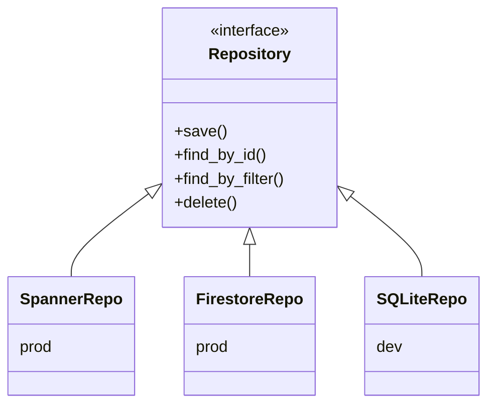
```mermaid
classDiagram
    class Repository {
        <<interface>>
        +save()
        +find_by_id()
        +find_by_filter()
        +delete()
    }
    class SpannerRepo {
        prod
    }
    class FirestoreRepo {
        prod
    }
    class SQLiteRepo {
        dev
    }
    Repository <|-- SpannerRepo
    Repository <|-- FirestoreRepo
    Repository <|-- SQLiteRepo
```

| Interface | Prod Implementation | Dev Implementation |
|---|---|---|
| `MapRepository` | `SpannerMapRepository` | `SQLiteMapRepository` |
| `MappingHistoryRepository` | `SpannerMappingHistoryRepository` | `SQLiteMappingHistoryRepository` |
| `FingerprintRepository` | `SpannerFingerprintRepository` | `SQLiteFingerprintRepository` |
| `RuleScoreRepository` | `FirestoreRuleScoreRepository` | `SQLiteRuleScoreRepository` |
| `TransformLogRepository` | `FirestoreTransformLogRepository` | `SQLiteTransformLogRepository` |
| `SequenceNumberRepository` | `FirestoreSequenceNumberRepository` | `SQLiteSequenceNumberRepository` |
| `ImportSessionRepository` | `FirestoreImportSessionRepository` | `SQLiteImportSessionRepository` |
| `FileStorageRepository` | `GCSFileStorageRepository` | `LocalFileStorageRepository` |

---

## 7. API Design

### 7.1 API Inventory

All APIs are RESTful over HTTPS, routed through Apigee (AP-15: API Gateway). Every request/response includes:
- `X-Correlation-Id` header (injected by Apigee if absent).
- `Authorization: Bearer <token>` header.
- Tenant scoping derived from the token's `tenant_id` claim.
- Rate limit headers: `X-RateLimit-Limit`, `X-RateLimit-Remaining`, `X-RateLimit-Reset`.

| # | Endpoint | Method | Description | SLA Target |
|---|---|---|---|---|
| 1 | `/v1/imports/upload` | `POST` | Initiate file upload (multipart) | — |
| 2 | `/v1/imports/{importId}/status` | `GET` | Get import session status and workflow state | — |
| 3 | `/v1/imports/{importId}/proposal` | `GET` | Retrieve auto-map proposal with confidence scores | ≤ 10s (first call triggers inference) |
| 4 | `/v1/imports/{importId}/proposal` | `PUT` | Update / adjust the proposed map (user corrections) | — |
| 5 | `/v1/imports/{importId}/validate` | `POST` | Execute one-click validation | ≤ 5s |
| 6 | `/v1/imports/{importId}/fix` | `POST` | Apply safe auto-fix batch | — |
| 7 | `/v1/imports/{importId}/prompt` | `POST` | Submit user-provided values for missing fields | — |
| 8 | `/v1/imports/{importId}/publish` | `POST` | Approve and publish the map | — |
| 9 | `/v1/imports/{importId}/preview` | `GET` | Get before/after preview of current transforms | — |
| 10 | `/v1/maps` | `GET` | List published maps for tenant (with filters) | — |
| 11 | `/v1/maps/{mapId}` | `GET` | Retrieve a specific map definition + lineage | — |
| 12 | `/v1/maps/{mapId}/versions` | `GET` | Retrieve version history for a map | — |
| 13 | `/v1/imports/{importId}/recommendations` | `GET` | Get reusable map recommendations for the current file | — |
| 14 | `/v1/imports/history` | `GET` | List import history for tenant | — |
| 15 | `/v1/imports/{importId}/output` | `GET` | Download the converted output file (CSV / XML) | — |
| 16 | `/v1/learning/metrics` | `GET` | Get system learning metrics: total imports learned, corrections remembered, accuracy trend | — |
| 17 | `/v1/learning/corrections/{fingerprint}` | `GET` | Get remembered mapping corrections for a file fingerprint | — |
| — | `/q/health/live` | `GET` | Liveness probe (process alive) | — |
| — | `/q/health/ready` | `GET` | Readiness probe (dependencies reachable, YAML loaded) | — |
| — | `/q/health/started` | `GET` | Startup probe (initial boot complete) | — |
| — | `/api/rules/reload` | `POST` | Admin: hot-reload validation rules from YAML | — |

### 7.2 Standard Error Contract (RFC 7807)

All error responses use `application/problem+json` per [RFC 7807](https://datatracker.ietf.org/doc/html/rfc7807):

```json
{
  "type": "urn:fileimport:error:VALIDATION_FAILED",
  "title": "Validation Failed",
  "status": 422,
  "detail": "3 validation errors found",
  "instance": "/v1/imports/abc-123/validate",
  "correlationId": "abc-123-def",
  "errors": [
    {
      "ruleId": "VR-BEN-002",
      "location": { "row": 5, "column": "D" },
      "message": "Beneficiary account number must be exactly 8 digits",
      "suggestion": "Left-pad with zeros to 8 digits"
    }
  ]
}
```

Error codes follow a stable, machine-readable taxonomy:

| Code | HTTP Status | Description |
|---|---|---|
| `FILE_TOO_LARGE` | 413 | Exceeds CSV 0.5 MB or XML 6 MB limit |
| `UNSUPPORTED_FORMAT` | 400 | File type not recognized |
| `ENTRY_LIMIT_EXCEEDED` | 400 | Payment entry count exceeds type limit |
| `VALIDATION_FAILED` | 422 | One or more validation rules failed |
| `SEQUENCE_NOT_UNIQUE` | 409 | Sequence number used within 24-hour window |
| `IMPORT_NOT_FOUND` | 404 | Import session does not exist |
| `UNAUTHORIZED` | 401 | Invalid or missing auth token |
| `FORBIDDEN` | 403 | Insufficient entitlements for payment type |
| `INTERNAL_ERROR` | 500 | Unexpected server error |
| `TOO_MANY_REQUESTS` | 429 | Rate limit exceeded (includes `Retry-After` header) |
| `NOT_ACCEPTABLE` | 406 | Unsupported `Accept` header value |
| `PRECONDITION_FAILED` | 412 | Stale `If-Match` ETag on proposal update |
| `SERVICE_UNAVAILABLE` | 503 | Dependency down (circuit breaker open) |

---

## 8. Event-Driven Architecture

### 8.1 Pub/Sub Topic Inventory

| Topic | Publisher | Subscriber(s) | Payload Summary |
|---|---|---|---|
| `file.uploaded` | File Upload Service | Import Interface Service | `{ fileId, tenantId, fingerprint, gcsPath, declaredType }` |
| `map.proposed` | Import Interface Service | Auto-Mapping Agent | `{ importId, tenantId, fileId, proposal, reuseCandidates }` |
| `validation.requested` | Auto-Mapping Agent | Validation Service | `{ importId, tenantId, mapSnapshot, parsedDataRef }` |
| `validation.done` | Validation Service | Auto-Mapping Agent | `{ importId, tenantId, status, errors[], summary }` |
| `fix.applied` | Auto-Mapping Agent | Validation Service (re-validate) | `{ importId, tenantId, fixBatch, iteration }` |
| `map.published` | Map Publishing Service | Self-Learning Service | `{ mapId, tenantId, fingerprint, rulesUsed, transformsUsed, outcome }` |
| `import.status` | All services | Frontend (via SSE/polling) | `{ importId, tenantId, status, timestamp, detail }` |

### 8.2 Dead-Letter Queue (DLQ) Strategy

- Each subscription has a DLQ topic (e.g., `file.uploaded.dlq`).
- Messages are forwarded to DLQ after `5` delivery attempts with exponential backoff (10s, 30s, 60s, 120s, 300s).
- DLQ messages trigger an alert in Cloud Monitoring.
- DLQ retention: `7 days` (configurable).
- A DLQ processor service can replay messages after root-cause resolution.

### 8.3 Message Ordering and Idempotency

- **Ordering**: Messages within a single import session use `importId` as the ordering key to guarantee sequence within a partition.
- **Idempotency**: Each service checks for duplicate message delivery by maintaining a processed-message cache (Firestore or Memorystore) keyed by `messageId`. If already processed, the message is acknowledged without re-processing.

---

## 9. Data Flow — End-to-End Import Pipeline

### 9.1 Sequence Diagram — Happy Path

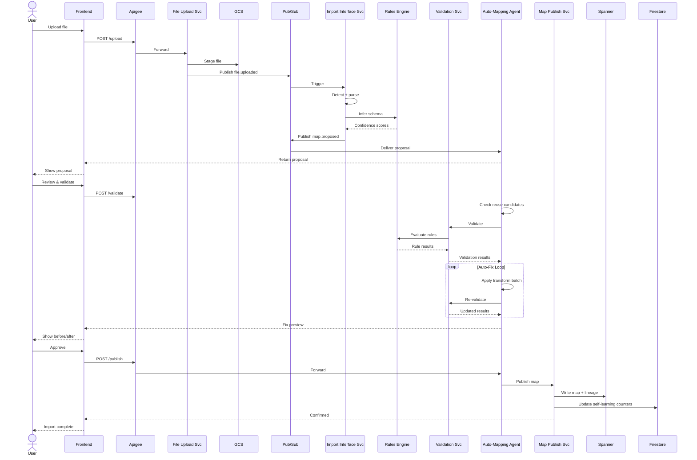
```mermaid
sequenceDiagram
    actor User
    participant FE as Frontend
    participant AG as Apigee
    participant FUS as File Upload Svc
    participant GCS
    participant PS as Pub/Sub
    participant IIS as Import Interface Svc
    participant RE as Rules Engine
    participant VS as Validation Svc
    participant AMA as Auto-Mapping Agent
    participant MPS as Map Publish Svc
    participant SP as Spanner
    participant FS as Firestore

    User->>FE: Upload file
    FE->>AG: POST /upload
    AG->>FUS: Forward
    FUS->>GCS: Stage file
    FUS->>PS: Publish file.uploaded
    PS->>IIS: Trigger
    IIS->>IIS: Detect + parse
    IIS->>RE: Infer schema
    RE-->>IIS: Confidence scores
    IIS->>PS: Publish map.proposed
    PS->>AMA: Deliver proposal
    AMA-->>FE: Return proposal
    FE-->>User: Show proposal

    User->>FE: Review & validate
    FE->>AG: POST /validate
    AMA->>AMA: Check reuse candidates
    AMA->>VS: Validate
    VS->>RE: Evaluate rules
    RE-->>VS: Rule results
    VS-->>AMA: Validation results

    loop Auto-Fix Loop
        AMA->>AMA: Apply transform batch
        AMA->>VS: Re-validate
        VS-->>AMA: Updated results
    end

    AMA-->>FE: Fix preview
    FE-->>User: Show before/after
    User->>FE: Approve
    FE->>AG: POST /publish
    AG->>AMA: Forward
    AMA->>MPS: Publish map
    MPS->>SP: Write map + lineage
    MPS->>FS: Update self-learning counters
    MPS-->>FE: Confirmed
    FE-->>User: Import complete
```

### 9.2 Sequence — Missing Field Prompt Flow

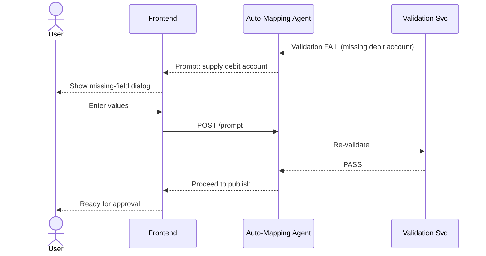
```mermaid
sequenceDiagram
    actor User
    participant FE as Frontend
    participant AMA as Auto-Mapping Agent
    participant VS as Validation Svc

    VS-->>AMA: Validation FAIL (missing debit account)
    AMA-->>FE: Prompt: supply debit account
    FE-->>User: Show missing-field dialog
    User->>FE: Enter values
    FE->>AMA: POST /prompt
    AMA->>VS: Re-validate
    VS-->>AMA: PASS
    AMA-->>FE: Proceed to publish
    FE-->>User: Ready for approval
```

---

## 10. Security Architecture

### 10.1 Authentication and Authorization

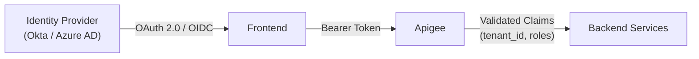
```mermaid
flowchart LR
    IDP["Identity Provider<br/>(Okta / Azure AD)"] -->|OAuth 2.0 / OIDC| FE[Frontend]
    FE -->|Bearer Token| APIGEE[Apigee]
    APIGEE -->|"Validated Claims<br/>(tenant_id, roles)"| BE[Backend Services]
```

| Layer | Mechanism |
|---|---|
| **User AuthN** | OAuth 2.0 Authorization Code flow with PKCE. Token issued by corporate IdP. |
| **API AuthZ** | Apigee validates token signature, expiry, audience. Extracts `tenant_id` and `roles` claims. |
| **Service AuthZ** | Workload Identity Federation. Each Cloud Run service runs under a dedicated service account with least-privilege IAM roles. |
| **Entitlement Check** | VR-GEN-006: "User/tenant must have sufficient entitlements to create the payment type." Checked at Apigee policy and within the Auto-Mapping Agent before publish. |

### 10.2 Data Protection

| Control | Implementation |
|---|---|
| **In Transit** | TLS 1.2+ enforced on all endpoints (Apigee, Cloud Run, GCS, Spanner, Firestore, Pub/Sub). |
| **At Rest** | Google-managed encryption keys (GMEK) by default; Customer-Managed Encryption Keys (CMEK) available for Spanner and GCS if required. |
| **PII Masking** | Account numbers, sort codes, and beneficiary names are masked in application logs (`****5678`, `****56`). Full values visible only in encrypted storage and authorized UI views. |
| **Tenant Isolation** | GCS path prefix by `tenant_id`; Spanner primary key includes `tenant_id`; Firestore collections scoped by `tenant_id`; Pub/Sub message attributes include `tenant_id` for subscription filtering. |

### 10.3 Security Controls Matrix

| Threat | Control | Component |
|---|---|---|
| Unauthorized access | OAuth 2.0 + Apigee token validation | Apigee |
| Cross-tenant data access | Tenant-scoped keys/prefixes on all storage | All services |
| File-based attacks (malicious XML, oversized payloads) | Size limit enforcement at gateway; XML parsing with entity expansion disabled (XXE protection) | File Upload Service, Import Interface Service |
| Data exfiltration via logs | PII masking in structured logs; log sink with restricted IAM | All services |
| Replay attacks | Idempotency checks; sequence number uniqueness | Multiple services |
| Privilege escalation | Least-privilege service accounts; no shared credentials | IAM |

---

## 11. Observability

### 11.1 Logging

| Aspect | Detail |
|---|---|
| **Framework** | Structured JSON logging to Cloud Logging. |
| **Correlation** | `X-Correlation-Id` propagated across all service calls and Pub/Sub messages. |
| **Log Levels** | `ERROR` (failures), `WARN` (validation warnings, retries), `INFO` (workflow transitions), `DEBUG` (rule evaluation detail — disabled in production by default). |
| **PII Policy** | Account numbers, sort codes, and beneficiary names masked in all log outputs. |
| **Retention** | 30 days hot (Cloud Logging), 90 days cold (Cloud Storage log sink). |

### 11.2 Distributed Tracing

| Aspect | Detail |
|---|---|
| **Framework** | Cloud Trace (OpenTelemetry integration). |
| **Span Boundaries** | One span per API call; one span per Pub/Sub message processing; child spans for rule evaluation, XSD validation, DB queries. |
| **Key Attributes** | `import_id`, `tenant_id`, `file_type`, `rule_count`, `error_count`, `duration_ms`. |

### 11.3 Metrics and Dashboards

| Metric | Type | Source | Dashboard |
|---|---|---|---|
| `import.success_rate` | Ratio | Map Publishing Service | Import Health |
| `import.failure_rate` | Ratio | Validation Service | Import Health |
| `import.first_pass_validation_rate` | Ratio | Validation Service | Import Health |
| `import.auto_fix_effectiveness` | Ratio | Auto-Fix Engine | Fix Analytics |
| `import.map_reuse_rate` | Ratio | Auto-Mapping Agent | Reuse Analytics |
| `import.mean_time_to_publish` | Histogram | Map Publishing Service | Import Health |
| `import.upload_to_proposal_latency` | Histogram | Import Interface Service | Performance |
| `import.validation_latency` | Histogram | Validation Service | Performance |
| `import.active_sessions` | Gauge | Auto-Mapping Agent | Capacity |
| `import.dlq_depth` | Gauge | Pub/Sub | Operations |
| `rules.evaluation_count` | Counter | Rules Engine | Rules Analytics |
| `rules.failure_by_rule_id` | Counter | Rules Engine | Rules Analytics |
| `transforms.applied_count` | Counter | Auto-Fix Engine | Fix Analytics |

### 11.4 Alerting

| Alert | Condition | Severity | Channel |
|---|---|---|---|
| High failure rate | `import.failure_rate > 20%` over 15 min | P2 | PagerDuty + Slack |
| DLQ accumulation | `import.dlq_depth > 10` messages | P2 | Slack |
| Slow validation | `import.validation_latency p95 > 10s` | P3 | Slack |
| Service unavailability | Cloud Run instance count = 0 AND requests queued | P1 | PagerDuty |
| Auth failures spike | `401/403 count > 50` in 5 min | P2 | PagerDuty + Slack |

---

## 12. Infrastructure and Deployment

### 12.1 GCP Resource Inventory

| Resource | Service | Configuration |
|---|---|---|
| Cloud Run — `frontend-spa` | Frontend | Min 0, Max 5, CPU 1, Mem 512 Mi |
| Cloud Run — `file-upload-svc` | File Upload Service | Min 0, Max 10, CPU 1, Mem 1 Gi, Timeout 60s |
| Cloud Run — `import-interface-svc` | Import Interface Service | Min 1, Max 20, CPU 2, Mem 2 Gi, Timeout 300s |
| Cloud Run — `rules-engine-svc` | Rules Engine | Min 1, Max 10, CPU 2, Mem 1 Gi |
| Cloud Run — `validation-svc` | Validation Service | Min 1, Max 20, CPU 2, Mem 2 Gi, Timeout 60s |
| Cloud Run — `auto-mapping-agent` | Auto-Mapping Agent | Min 1, Max 10, CPU 2, Mem 2 Gi, Timeout 600s |
| Cloud Run — `map-publish-svc` | Map Publishing Service | Min 0, Max 10, CPU 1, Mem 1 Gi |
| GCS — `{project}-import-staging` | File Storage | Standard class, regional, lifecycle: delete after 90 days |
| Spanner — `map-registry` | Map Registry | 1 node (regional), auto-scaling |
| Firestore — `(default)` | Self-Learning, Session State | Native mode, regional |
| Pub/Sub — 7 topics + subscriptions | Event Orchestration | Message retention 7 days |
| Apigee — `import-api-proxy` | API Gateway | Standard tier |
| Cloud Monitoring | Observability | Dashboards, alerts, uptime checks |
| Cloud Trace | Distributed Tracing | Always-on sampling |
| Cloud Logging | Centralized Logs | 30-day retention + log sink |

### 12.2 Deployment Architecture

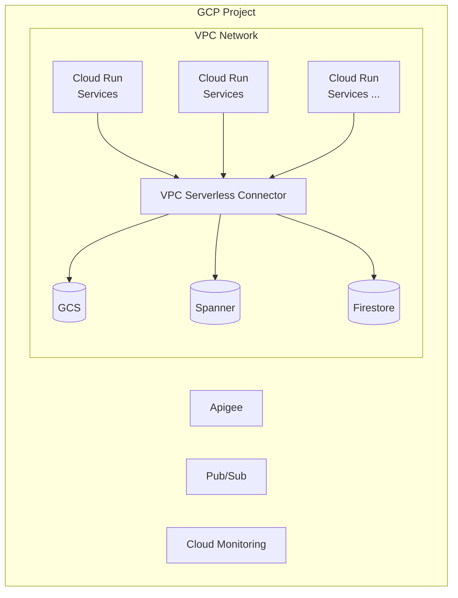
```mermaid
graph TB
    subgraph GCP_Project["GCP Project"]
        subgraph VPC["VPC Network"]
            CR1["Cloud Run<br/>Services"]
            CR2["Cloud Run<br/>Services"]
            CR3["Cloud Run<br/>Services ..."]
            VPCC["VPC Serverless Connector"]
            CR1 --> VPCC
            CR2 --> VPCC
            CR3 --> VPCC
            VPCC --> GCS_D[("GCS")]
            VPCC --> SPANNER_D[("Spanner")]
            VPCC --> FS_D[("Firestore")]
        end
        APIGEE_D["Apigee"]
        PUBSUB_D["Pub/Sub"]
        MONITOR_D["Cloud Monitoring"]
    end
```

### 12.3 CI/CD Pipeline

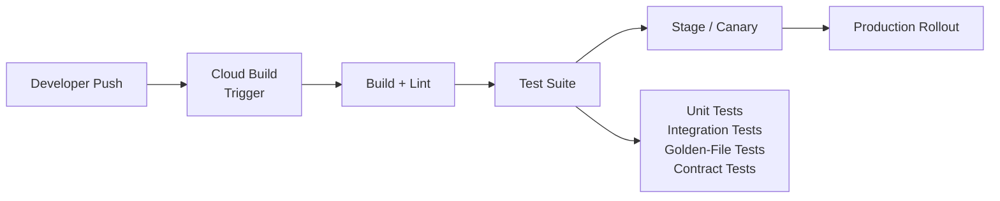
```mermaid
flowchart LR
    A[Developer Push] --> B[Cloud Build<br/>Trigger]
    B --> C[Build + Lint]
    C --> D[Test Suite]
    D --> E[Stage / Canary]
    E --> F[Production Rollout]
    D --> G[Unit Tests<br/>Integration Tests<br/>Golden-File Tests<br/>Contract Tests]
```

| Stage | Detail |
|---|---|
| **Build + Lint** | Docker image build; linting; static analysis; dependency vulnerability scan. |
| **Test Suite** | Unit tests (parser, rules, transforms); integration tests (Pub/Sub flow, API contracts); golden-file regression (known good/bad samples per format). |
| **Stage (Canary)** | Deploy to staging environment; run smoke tests against golden files; canary traffic split (10% → 50% → 100%). |
| **Production Rollout** | Gradual traffic shift; automated rollback on error-rate spike (> 5% increase). |

### 12.4 Infrastructure as Code

| Concern | Tool |
|---|---|
| GCP resources (Cloud Run, GCS, Spanner, Firestore, Pub/Sub) | Terraform |
| Apigee proxy configuration | Terraform + apigeectl |
| Cloud Build pipelines | `cloudbuild.yaml` |
| Monitoring dashboards and alerts | Terraform (Cloud Monitoring provider) |

### 12.5 Environment Profiles — Dev (Local) vs Prod (GCP)

The system is designed to run on **two environment profiles** that share the same application code but differ in infrastructure bindings.

#### 12.5.1 Profile Summary

| Concern | Dev (Local Machine) | Prod (GCP) |
|---|---|---|
| **Compute** | Python processes (FastAPI / Flask) run directly on the developer's machine. No containers required for inner-loop dev (Docker optional). | Cloud Run containers (auto-scaling). |
| **LLM** | **Ollama** (local, `http://localhost:11434/v1`). Recommended model: `mistral` or `llama3`. | Vertex AI (Gemini) or Cloud Run-hosted model endpoint. |
| **Database** | **SQLite** — single file `./data/import.db`. Zero install, zero config. | **Spanner** (Map Registry) + **Firestore** (self-learning, sessions). |
| **File Storage** | **Local filesystem** `./data/storage/{tenant_id}/{file_id}/` | **GCS** bucket `gs://{project}-import-staging/` |
| **Event Bus** | **In-process function calls** (synchronous pipeline). No Pub/Sub dependency. Optionally: Python `asyncio` queues for simulating async behaviour. | **Pub/Sub** (7 topics). |
| **API Gateway** | None — direct HTTP to FastAPI. Auth bypassed or mocked via `X-Tenant-Id` header. | **Apigee** (OAuth, rate limits, routing). |
| **Observability** | Console/file logging (`./logs/`). No tracing. | Cloud Logging + Cloud Trace + Cloud Monitoring. |
| **Auth** | Mocked. `tenant_id = "local"`, `user = "local-dev"`. | OAuth 2.0 / OIDC via corporate IdP. |

#### 12.5.2 Local Dev Architecture Diagram

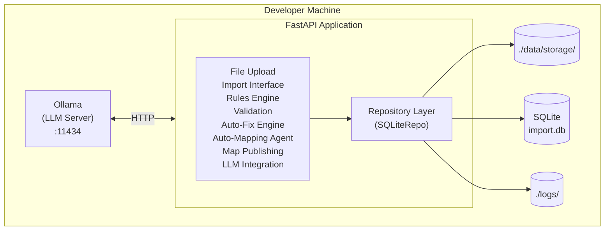
```mermaid
graph TB
    subgraph DEV["Developer Machine"]
        OLLAMA["Ollama<br/>(LLM Server)<br/>:11434"]
        subgraph FASTAPI["FastAPI Application"]
            SERVICES["File Upload<br/>Import Interface<br/>Rules Engine<br/>Validation<br/>Auto-Fix Engine<br/>Auto-Mapping Agent<br/>Map Publishing<br/>LLM Integration"]
            REPO["Repository Layer<br/>(SQLiteRepo)"]
            SERVICES --> REPO
        end
        OLLAMA <-->|HTTP| FASTAPI
        REPO --> STORAGE[("./data/storage/")]
        REPO --> SQLITE[("SQLite<br/>import.db")]
        REPO --> LOGS[("./logs/")]
    end
```

#### 12.5.3 Configuration Switching

A single configuration file (`.env` or `config/{env}.yaml`) controls all infrastructure bindings.

Business rules and transforms are stored separately from infrastructure config to enable independent versioning:

```
config/
├── dev.yaml                         # Infrastructure bindings (DB, LLM, events, auth)
├── prod.yaml                        # Infrastructure bindings (production)
└── rules/
    ├── validation-rules.yaml        # 85 validation rules (all categories)
    └── transforms.yaml              # 21 auto-fix transform definitions
```

**Key principle (AP-10)**: No business rule, threshold, pattern, or transform definition is hardcoded in Java. All are externalized to YAML. This enables:
- Non-developer rule changes (ops/compliance teams can modify thresholds)
- Audit trail via Git history on YAML files
- Environment-specific rule toggling (`enabled: false`)
- CI validation of rule YAML schema before deployment

**Infrastructure config:**

```yaml
# config/dev.yaml
env: dev

database:
  type: sqlite
  path: ./data/import.db

file_storage:
  type: local
  base_path: ./data/storage

llm:
  base_url: http://localhost:11434/v1
  model: mistral
  api_key:            # empty — Ollama needs no key
  timeout_ms: 15000
  confidence_threshold: 0.6

event_bus:
  type: sync          # in-process synchronous calls

auth:
  type: mock
  default_tenant_id: local
  default_user: local-dev

logging:
  level: DEBUG
  output: console
```

```yaml
# config/prod.yaml
env: prod

database:
  type: spanner+firestore
  spanner_instance: map-registry
  spanner_database: import-maps
  firestore_project: ${GCP_PROJECT}

file_storage:
  type: gcs
  bucket: ${GCP_PROJECT}-import-staging

llm:
  base_url: https://${GCP_REGION}-aiplatform.googleapis.com/v1/projects/${GCP_PROJECT}/locations/${GCP_REGION}/endpoints/${LLM_ENDPOINT}
  model: gemini-1.5-flash
  api_key: workload-identity     # resolved at runtime
  timeout_ms: 5000
  confidence_threshold: 0.6

event_bus:
  type: pubsub
  project: ${GCP_PROJECT}

auth:
  type: oauth2
  provider: apigee

logging:
  level: INFO
  output: cloud-logging
```

#### 12.5.4 Ollama Setup (Dev Prerequisites)

| Step | Command / Action |
|---|---|
| 1. Install Ollama | `brew install ollama` (macOS) or see [ollama.com](https://ollama.com) |
| 2. Pull a model | `ollama pull mistral` (or `ollama pull llama3`) |
| 3. Start Ollama server | `ollama serve` (runs on `http://localhost:11434`) |
| 4. Verify | `curl http://localhost:11434/v1/models` — should list the pulled model |
| 5. Set env (optional) | `export LLM_MODEL=mistral` |

#### 12.5.5 SQLite Setup (Dev Prerequisites)

| Step | Detail |
|---|---|
| 1. No install needed | SQLite is bundled with Python's standard library (`sqlite3` module). |
| 2. Auto-create on first run | The application creates `./data/import.db` and runs the schema migration (Section 6.4) on startup if the file does not exist. |
| 3. Reset | Delete `./data/import.db` to start fresh. |

#### 12.5.6 Dev ↔ Prod Parity Guardrails

| Risk | Mitigation |
|---|---|
| SQLite lacks Spanner-specific features (interleaved tables, commit timestamps) | Repository layer abstracts these; SQLite uses triggers for `updated_at`. |
| Ollama model differs from Vertex AI Gemini | LLM output is always re-validated by deterministic Rules Engine; model drift does not affect correctness, only mapping confidence. |
| No Pub/Sub in dev | Synchronous in-process pipeline preserves the same logical flow. Integration tests against a Pub/Sub emulator are run in CI. |
| No Apigee in dev | Auth is mocked; API contracts are identical (same FastAPI routes). |
| SQLite single-writer limitation | Acceptable for single-developer local use. CI integration tests use Pub/Sub emulator + Firestore emulator. |

---

## 13. Scalability and Performance

### 13.1 Performance Targets

| Metric | Target | Basis |
|---|---|---|
| Upload to initial map proposal | ≤ 10s | Standard file (CSV ≤ 0.5 MB, ≤ 1,250 entries) |
| Validation response | ≤ 5s | Standard payload |
| Auto-fix iteration | ≤ 3s | Per iteration (max 3 iterations) |
| End-to-end happy path | ≤ 30s | Upload → proposal → validate → publish (excluding user interaction time) |
| Concurrent imports per tenant | 5 (configurable) | Rate-limited at Apigee |

### 13.2 Scaling Strategy

| Component | Scaling Model | Min | Max | Scale Trigger |
|---|---|---|---|---|
| File Upload Service | Cloud Run autoscale | 0 | 10 | Request concurrency > 10 |
| Import Interface Service | Cloud Run autoscale | 1 | 20 | CPU utilization > 60% |
| Validation Service | Cloud Run autoscale | 1 | 20 | Request concurrency > 5 |
| Rules Engine | Cloud Run autoscale | 1 | 10 | CPU utilization > 60% |
| Auto-Mapping Agent | Cloud Run autoscale | 1 | 10 | Active sessions |
| Map Publishing Service | Cloud Run autoscale | 0 | 10 | Request concurrency > 5 |
| Spanner | Node autoscaling | 1 | 3 | CPU > 65% |
| Pub/Sub | Managed (unlimited) | — | — | — |

### 13.3 Bottleneck Mitigation

| Bottleneck | Mitigation |
|---|---|
| Large XML parsing (up to 6 MB) | Streaming SAX/StAX parser; avoid full DOM load. |
| XSD validation on large files | Parallelized per-`PmtInf` block validation. |
| Rule evaluation at scale (85 rules × 1,250 entries) | Rule evaluation pipeline with early-exit on structural failures; batch processing. |
| Spanner write contention on publish | Write transactions scoped to single map; avoid hot-spotting by using UUIDv4 keys. |
| Pub/Sub message fan-out | Use ordering keys per `importId` to avoid out-of-order processing. |

---

## 14. Reliability and Fault Tolerance

### 14.1 Availability Target

| Tier | Target | Scope |
|---|---|---|
| User-facing APIs (upload, validate, publish) | 99.9% monthly | Measured at Apigee layer |
| Async processing (Pub/Sub-driven stages) | 99.95% eventual completion | Measured via DLQ depth |

### 14.2 Failure Modes and Recovery

| Failure Mode | Detection | Recovery |
|---|---|---|
| Cloud Run instance crash mid-processing | Pub/Sub redelivery (ack timeout) | Idempotent retry; up to 5 attempts. |
| Spanner write failure | Transaction error code | Retry with exponential backoff (up to 3 retries). |
| GCS upload failure | HTTP error code | Client-side retry with resumable upload protocol. |
| Pub/Sub delivery failure | DLQ accumulation alert | Manual investigation + replay from DLQ. |
| Validation timeout (> 60s) | Cloud Run timeout | Return partial results with `TIMEOUT` status; user can re-trigger. |
| Rules Engine unavailable | gRPC health check failure | Circuit breaker → OPEN state (MicroProfile `@CircuitBreaker`: 5 failures, 30s window). Fallback: cached last-known-good rule results. Metrics: `circuit_breaker_state` gauge. Half-open probe after 30s. |
| LLM/Ollama unavailable | HTTP timeout (15s dev, 5s prod) | Circuit breaker → OPEN. Fallback: skip LLM → manual prompt flow. Bulkhead: LLM calls isolated to dedicated thread pool (max 5 threads). |
| Corrupt file upload | Checksum mismatch post-staging | Reject with clear error; user re-uploads. |

### 14.3 Data Durability

| Data | Durability | Backup |
|---|---|---|
| Uploaded files (GCS) | 99.999999999% (11 nines) | Native GCS redundancy; cross-region optional. |
| Map Registry (Spanner) | 99.999% | Spanner automated backups; daily export to GCS. |
| Self-Learning data (Firestore) | 99.999% | Firestore automated backups. |
| Pub/Sub messages | 7-day retention | DLQ for failed messages. |

---

## 15. File Processing Architecture Detail

### 15.1 Parser Architecture

Each file type has a dedicated parser that produces a uniform **Canonical Record Model** (CRM):

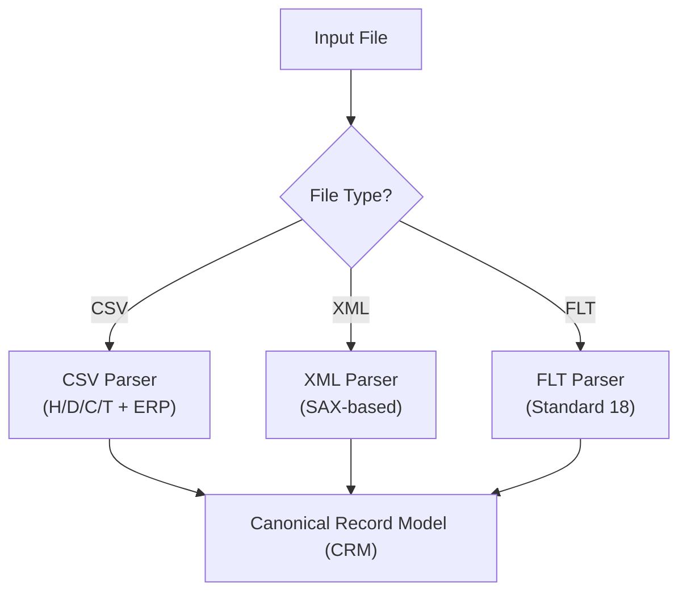
```mermaid
flowchart TD
    A[Input File] --> B{File Type?}
    B -->|CSV| C["CSV Parser<br/>(H/D/C/T + ERP)"]
    B -->|XML| D["XML Parser<br/>(SAX-based)"]
    B -->|FLT| E["FLT Parser<br/>(Standard 18)"]
    C --> F["Canonical Record Model (CRM)"]
    D --> F
    E --> F
```

### 15.2 Canonical Record Model (CRM) — Formal Schema

The CRM is the **single normalized representation** of a payment file. Every parser produces it; every output generator consumes it. The schema is the superset of all fields across all 4 input formats and both output formats.

```python
from dataclasses import dataclass, field
from datetime import date, datetime
from decimal import Decimal
from typing import Optional


@dataclass
class CreditTransaction:
    """One beneficiary payment.
    Maps to: CSV C-record | XML <CdtTrfTxInf> | FLT record.
    """
    amount: Decimal                              # >= 0.01, no commas. Pounds with 2dp.
    currency: str = "GBP"                        # ISO 4217. CSV: implicit GBP. XML: <InstdAmt Ccy="...">.
    beneficiary_name: str = ""                   # Max 18 chars. Trim/pad from FLT.
    beneficiary_account: str = ""                # Exactly 8 digits.
    beneficiary_sort_code: str = ""              # Exactly 6 digits, no dashes.
    beneficiary_reference: Optional[str] = None  # Max 18 chars. If absent → remove XML subtree.
    end_to_end_id: Optional[str] = None          # XML-only (<EndToEndId>). CSV: auto-gen or skip.
    # --- Provenance ---
    source_line: Optional[int] = None            # Raw line number in source file (for error reporting).


@dataclass
class PaymentGroup:
    """One debit + its credits.
    Maps to: CSV D→C* group | XML <PmtInf> | FLT all-records-share-one-debit.
    """
    # --- Debit-side fields ---
    value_date: date                             # CSV: YYYYMMDD. XML: YYYY-MM-DD. FLT: pos 71-78.
    debit_sort_code: str = ""                    # 6 digits (part 1 of composite account).
    debit_account_number: str = ""               # 8 digits (part 2 of composite account).
    debit_account_reference: Optional[str] = None  # Optional, 6-18 chars, >=2 unique. XML: <CtgyPurp><Prtry>.
    # --- XML-specific (written during output generation) ---
    payment_info_id: Optional[str] = None        # <PmtInfId>. Auto-gen if not provided.
    payment_method: str = "TRA"                  # Fixed. <PmtMtd>.
    local_instrument: str = "UKBACS"             # Fixed. <LclInstrm><Prtry>.
    # --- Credits ---
    credits: list[CreditTransaction] = field(default_factory=list)
    # --- Provenance ---
    source_line: Optional[int] = None


@dataclass
class FileEnvelope:
    """Top-level file wrapper.
    Maps to: CSV H/T records | XML <GrpHdr>.
    """
    creation_date: datetime                      # CSV H:B (date only). XML: full ISO datetime.
    sequence_number: Optional[str] = None        # CSV H:C. Not present in XML.
    transaction_count: Optional[int] = None      # XML <NbOfTxs>. CSV: derived from credit count.
    # --- XML-specific (written during output generation) ---
    message_id: str = "COMMERCIAL BANKING ONLINE"  # Fixed. <MsgId>.


@dataclass
class ProcessingMetadata:
    """Non-payment data for tracking and diagnostics."""
    source_type: str             # "CBO_CSV" | "BACS_XML" | "STANDARD_18" | "ERP_CSV"
    source_file_name: str
    source_file_hash: str        # SHA-256 fingerprint.
    record_count: int            # Total credit transactions parsed.
    raw_line_refs: list[int] = field(default_factory=list)  # All source line numbers consumed.
    parse_warnings: list[str] = field(default_factory=list)
    supplemental_values: dict = field(default_factory=dict)
        # ^ Captures user-supplied values from prompts (e.g. debit account for ERP files).


@dataclass
class CanonicalRecordModel:
    """The complete normalized representation of a payment file."""
    envelope: FileEnvelope
    payment_groups: list[PaymentGroup]   # 1..* groups, each with 1..* credits.
    metadata: ProcessingMetadata
```

#### 15.2.1 CRM ↔ Format Mapping

| CRM Field | CBO CSV | BACS XML | Standard 18 (FLT) | ERP CSV |
|---|---|---|---|---|
| `envelope.creation_date` | H:B `YYYYMMDD` | `<GrpHdr><CreDtTm>` ISO datetime | Not present — use import timestamp | Not present — use import timestamp |
| `envelope.sequence_number` | H:C | N/A (`<MsgId>` used instead) | N/A — auto-generate | N/A — auto-generate |
| `envelope.transaction_count` | Derived (count of C-records) | `<NbOfTxs>` | Derived (line count) | Derived (row count) |
| `group.value_date` | D:B `YYYYMMDD` | `<ReqdExctnDt>` `YYYY-MM-DD` | Pos 71-78 `YYYYMMDD` | `Date of Payment Run` `DD.MM.YY` → reformat |
| `group.debit_sort_code` | D:D (first 6 of composite) | `<DbtrAcct>...<Id>` (first 6) | Pos 15-20 | **Missing** — prompt user |
| `group.debit_account_number` | D:D (last 8 of composite) | `<DbtrAcct>...<Id>` (last 8) | Pos 21-28 | **Missing** — prompt user |
| `group.debit_account_reference` | D:C (optional) | `<CtgyPurp><Prtry>` (optional) | Pos 79-100 (trimmed) | Not present (optional) |
| `credit.amount` | C:B decimal | `<InstdAmt>` decimal | Pos 33-43 pence ÷ 100 | `Amount (LC)` — already decimal |
| `credit.currency` | Implicit `GBP` | `<InstdAmt Ccy="...">` | Implicit `GBP` | `Payment Document Currency` |
| `credit.beneficiary_name` | C:C (max 18) | `<Cdtr><Nm>` (max 18) | Pos 44-61 (trim spaces) | `Payment Name` |
| `credit.beneficiary_account` | C:D (8 digits) | `<CdtrAcct>...<Id>` (8 digits) | Pos 7-14 | `Payment Bank Account` |
| `credit.beneficiary_sort_code` | C:E (6 digits) | `<CdtrAgt>...<MmbId>` (6 digits) | Pos 1-6 | `Payee Bank Branch` |
| `credit.beneficiary_reference` | C:F (optional, max 18) | `<RmtInf>...<Prtry>` (optional) | Pos 62-66 (partial) | Not present (optional) |
| `credit.end_to_end_id` | N/A | `<EndToEndId>` (mandatory) | N/A — auto-gen | N/A — auto-gen |
| `metadata.source_type` | `CBO_CSV` | `BACS_XML` | `STANDARD_18` | `ERP_CSV` |

#### 15.2.2 Fields Deliberately Excluded from the CRM

| Omitted | Reason |
|---|---|
| CSV record-type markers (`H`, `D`, `C`, `T`) | Structural — generated by the CSV writer, not payment data. |
| XML empty tags (`<InitgPty/>`, `<Dbtr/>`, `<FinInstnId/>`) | Structural — injected by the XML builder per spec. |
| ERP row index (`#`), `Supplier code`, `Amount (FC)` | No BACS mapping — discarded during parse. |
| Standard 18 padding/reserved positions | Whitespace — trimmed by parser. |
| XML fixed values (`MsgId`, `PmtMtd`, `Prtry`) | Stored as defaults on dataclass; overwritten only if input explicitly provides them. |

### 15.3 Output Generation

The Canonical Record Model is converted to the target format:

| Target | Generator | Key Logic |
|---|---|---|
| **BACS CSV** | CSV Writer | Emit `H`, `D`, `C` (per credit), `T` records per Appendix C layout. Dates in `YYYYMMDD`. |
| **BACS XML** | XML Builder | Build `pain.001.001.03` document per Appendix A schema. Set fixed values (MsgId, PmtMtd, Prtry). Inject empty elements (InitgPty/, Dbtr/, FinInstnId/). Apply conditional tag removal for absent optionals. |

---

## 16. Reuse and Recommendation Engine

### 16.1 Fingerprint-Based Matching

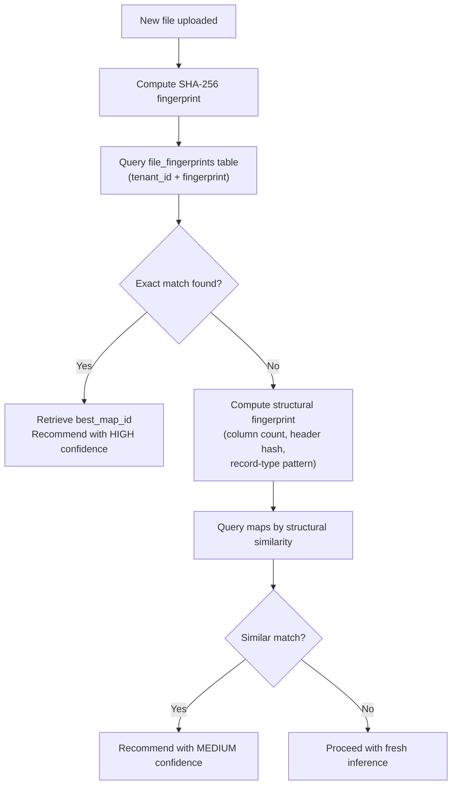
```mermaid
flowchart TD
    A[New file uploaded] --> B[Compute SHA-256 fingerprint]
    B --> C["Query file_fingerprints table<br/>(tenant_id + fingerprint)"]
    C --> D{Exact match found?}
    D -->|Yes| E["Retrieve best_map_id<br/>Recommend with HIGH confidence"]
    D -->|No| F["Compute structural fingerprint<br/>(column count, header hash,<br/>record-type pattern)"]
    F --> G[Query maps by structural similarity]
    G --> H{Similar match?}
    H -->|Yes| I[Recommend with MEDIUM confidence]
    H -->|No| J[Proceed with fresh inference]
```

### 16.2 Scoring and Promotion

| Signal | Weight | Effect |
|---|---|---|
| Map published successfully | +10 | Increases map's reuse score |
| Map reused and validated successfully | +5 | Reinforces the map |
| Map reused but validation failed | -3 | Reduces confidence |
| Rule applied and contributed to success | +1 per rule | Promotes rule in ranking |
| Rule applied and contributed to failure | -2 per rule | Demotes rule |
| User corrected a mapped field | -1 for original mapping confidence | Adjusts field-level confidence |

---

## 17. Testing Architecture

### 17.1 Test Pyramid

```mermaid
graph TD
    subgraph Pyramid["Test Pyramid"]
        direction TB
        E2E["E2E Tests<br/>(few, expensive)<br/>Golden Files"]
        INT["Integration Tests<br/>(moderate)<br/>API + Pub/Sub + Storage"]
        UNIT["Unit Tests<br/>(many, fast)<br/>Parsers, Rules, Transforms, Validators"]
        E2E ~~~ INT
        INT ~~~ UNIT
    end

    style E2E fill:#f9d,stroke:#333,width:200px
    style INT fill:#fdb,stroke:#333,width:350px
    style UNIT fill:#bfd,stroke:#333,width:500px
```

### 17.2 Golden-File Test Suite

| Test File | Format | Purpose | Expected Outcome |
|---|---|---|---|
| `BACS_v4.xml` | XML | Valid pain.001.001.03 reference | Validation PASS |
| `Example File BACS Apr 23 LLOYDS 1.xlsx` → CSV | CSV | Valid CBO H/D/C/T reference | Validation PASS |
| `fixed_length_test.txt` | FLT | Standard 18 positional records | Parse + auto-fix (pence → pounds) → PASS |
| `payment_run_test.csv` | ERP CSV | Non-standard ERP export | Parse + detect missing fields → prompt → PASS |
| Malformed XML (missing GrpHdr) | XML | Structural failure | Validation FAIL (VR-STRUCT-006) |
| CSV with reused sequence number | CSV | Uniqueness violation | Validation FAIL (VR-SEQ-002) |
| CSV with amount commas | CSV | Format issue | Auto-fix (TF-STRIP-COMMA) → PASS |
| ERP CSV with ambiguous dates | ERP | Date ambiguity | Prompt user (VR-DATE-007) |

### 17.3 Contract Testing

- API contracts validated using OpenAPI spec + Prism mock server.
- Pub/Sub message schemas validated using JSON Schema or Protocol Buffers.
- Contract tests run in CI on every PR.

---

## 18. Glossary

| Term | Definition |
|---|---|
| **BACS** | Bankers' Automated Clearing Services — UK payment clearing system. |
| **CBO** | Commercial Banking Online — Lloyds Bank's online banking platform. |
| **CRM** | Canonical Record Model — internal normalized representation of a payment file. |
| **DLQ** | Dead-Letter Queue — holds messages that failed processing after max retries. |
| **ERP** | Enterprise Resource Planning system (e.g., SAP, Oracle). |
| **H/D/C/T** | Header / Debit / Credit / Trailer — record types in CBO BACS CSV format. |
| **ISO 20022** | International standard for financial messaging. |
| **pain.001** | ISO 20022 Customer Credit Transfer Initiation message (payment instruction). |
| **Standard 18** | BACS fixed-length 100-character positional record format. |
| **XSD** | XML Schema Definition — defines the structure of valid XML documents. |
| **Ollama** | Local LLM runtime — serves open-weight models (Mistral, LLaMA, etc.) via an OpenAI-compatible REST API on `localhost:11434`. |
| **SQLite** | Lightweight embedded relational database — used as the local dev replacement for Spanner and Firestore. |

---

## 19. Decision Log

| # | Decision | Rationale | Date | Status |
|---|---|---|---|---|
| D-1 | Use Cloud Run (not GKE) for all compute | Serverless simplicity; autoscale to zero; sufficient for expected load. | 2026-02-26 | Accepted |
| D-2 | Use Spanner (not Cloud SQL) for Map Registry | Strong consistency + global distribution for future multi-region. Versioned queries. | 2026-02-26 | Accepted |
| D-3 | Use Firestore (not Bigtable) for self-learning | Low-latency document reads; flexible schema; good for counter patterns. | 2026-02-26 | Accepted |
| D-4 | SAX/StAX parser for XML (not DOM) | Memory efficiency for files up to 6 MB. | 2026-02-26 | Accepted |
| D-5 | Synchronous gRPC for Rules Engine calls | Latency-sensitive; intra-service call within same region. | 2026-02-26 | Accepted |
| D-6 | Pub/Sub for inter-service orchestration | Decoupled; idempotent retry; DLQ support; ordering keys. | 2026-02-26 | Accepted |
| D-7 | No ML — heuristic/counter-based self-learning only | Per requirements (Section 7.6); reduces complexity and audit burden. | 2026-02-26 | Accepted |
| D-8 | Canary deployment strategy for rule-pack updates | Reduces blast radius of rule changes across tenants. Achieved via `enabled` flag per rule in YAML. | 2026-02-26 | Accepted |
| D-9 | SQLite for local dev database (not Spanner/Firestore) | Zero-install, zero-config; single-file DB sufficient for single-developer inner-loop. Repository abstraction ensures code parity with prod. | 2026-02-26 | Accepted |
| D-10 | Ollama for local dev LLM (not Vertex AI) | Runs fully offline on developer machine; OpenAI-compatible API matches prod interface. No API key or cloud dependency needed. | 2026-02-26 | Accepted |
| D-11 | In-process synchronous event bus for dev (not Pub/Sub) | Removes Docker/emulator dependency for inner-loop dev. CI uses Pub/Sub emulator for integration tests. | 2026-02-26 | Accepted |
| D-12 | Repository abstraction layer for storage backends | Enables transparent switching between SQLite (dev) and Spanner/Firestore (prod) without changing service logic. | 2026-02-26 | Accepted |
| D-13 | YAML-driven validation rules and transforms (not hardcoded) | Follows AP-10 (Externalized Configuration), OCP (SOLID), Strategy pattern. All 85 rules and 22 transforms declared in `config/rules/*.yaml`. Java code provides ~20 reusable evaluator classes and ~10 transformer classes. Adding/modifying rules is a YAML-only change. | 2026-02-26 | Accepted |

---

## 20. Open Items

| # | Item | Owner | Target Date |
|---|---|---|---|
| O-1 | Finalize exact BACS Standard 18 positional spec (confirm against official documentation) | Architecture | TBD |
| ~~O-2~~ | ~~Define canonical target schema for golden BACS CSV fields (formalize CRM)~~ | ~~Engineering~~ | **Resolved** — See Section 15.2. |
| O-3 | Define clarification prompt policy and max user-interaction steps | Product | TBD |
| O-4 | Rule ownership and governance process | Platform Engineering | TBD |
| O-5 | Backfill / migration strategy for existing customer mappings | Engineering | TBD |
| O-6 | CMEK vs GMEK decision for Spanner and GCS encryption | Security | TBD |
| O-7 | CBO API integration (future phase) vs manual file upload to CBO portal | Product | TBD |
| O-8 | Multi-region deployment requirements | Architecture | TBD |
| O-9 | Tiered processing SLAs per tenant | Product | TBD |
| O-10 | Evaluate whether to use `llama3` or `mistral` as default Ollama dev model (benchmark inference quality on BACS mapping samples) | Engineering | TBD |
| O-11 | Determine if Pub/Sub emulator should be added to local dev Docker Compose for async testing | Engineering | TBD |

---

*End of Architecture Document*
