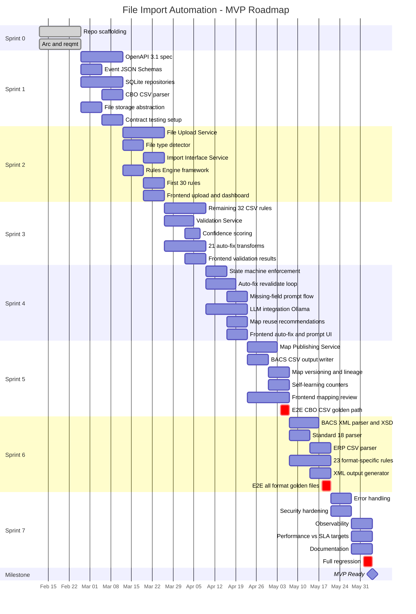

# File Import Automation — Implementation Plan

**Version**: 1.2  
**Date**: 26 February 2026  
**Scope**: Local MVP (SQLite + Ollama + local FS)  
**Sprint Length**: 2 weeks  
**Team**: 2–3 developers  
**Golden Path Format**: CBO CSV (H/D/C/T)

---

## Roadmap

| Sprint | Weeks | Stream A — Services | Stream B — Rules / Agent | Stream C — Frontend / Test |
|:------:|:-----:|---------------------|--------------------------|----------------------------|
| **S0** ✅ | 0 | Repo scaffolding | Architecture doc | Requirements doc |
| **S1** | 1–2 | OpenAPI 3.1 spec (15 endpoints)   Event JSON Schemas (7 topics) | SQLite repos (all 7 entities)   CBO CSV parser to CRM | File storage abstraction   Prism mock server setup |
| **S2** | 3–4 | File Upload Service   Import Interface (CBO CSV)   File type detector | Rules Engine framework   First 30 rules (FILE, STRUCT, SEQ, DATE, AMT) | Upload flow   Dashboard   Unit tests: parsers |
| **S3** | 5–6 | Validation Service   Confidence scoring | Remaining 32 CSV rules (DBT, BEN, GEN)   21 auto-fix transforms | Validation results view   Confidence badges   Unit tests: rules |
| **S4** | 7–8 | State machine enforcement   LLM integration (Ollama)   Map reuse / recommendation | Auto-fix revalidate loop   Missing-field prompt flow | Auto-fix preview   Prompt dialog   Unit tests: transforms |
| **S5** | 9–10 | Map Publishing Service   BACS CSV output writer   **E2E: CBO CSV golden path** | Self-learning counters   Map versioning + lineage | Mapping review   Publish confirm   Import history |
| **S6** | 11–12 | BACS XML parser + XSD   Standard 18 parser   ERP CSV parser | 23 format-specific rules (VR-XML, VR-FLT, VR-ERP) | XML output generator   **E2E: all format golden files**   Integration test suite |
| **S7** | 13–14 | Error handling + hardening   Security (XXE, PII masking) | Performance vs SLA targets   Observability (logging, tracing) | Polish + documentation   Runbook + API guide   **Full regression** |
| **S8+** | TBD | *Prod GCP path (deferred)* | *Cloud migration* | *Production UI* |

### Gantt Chart

---

## Sprint 0 — Repo Scaffolding (COMPLETE)

Already delivered:
- Maven multi-module monorepo (root POM + 9 modules)
- Common module: CRM records, 3 repository interfaces + SQLite `MapRepository`, CDI event bus
- 8 service stubs with health-check endpoints (ports 8081–8088)
- Frontend scaffold: React 18 + Vite + Tailwind + 5 pages + API service layer + Zustand store
- Config: `config/dev.yaml`, `config/prod.yaml`
- Scripts: `scripts/init-db.sql`, `scripts/init-db.sh`, `scripts/start-dev.sh`
- Docs: `docs/architecture.md` v1.3, `docs/detailed_requirements.md` v1.1

---

## Sprint 1 — API Contracts + Core Infrastructure (Weeks 1–2)

**Goal**: All API and event contracts locked; all repositories working; CBO CSV parser producing CRM output.

### 1.1 OpenAPI 3.1 Specification
- Create `docs/openapi/file-import-api.yaml`
- Define all 15 endpoints from architecture Section 7:
  - `POST /v1/imports/upload` (multipart, `UploadResponse`)
  - `GET /v1/imports/{importId}/status` (`ImportDetail`)
  - `GET /v1/imports/{importId}/proposal` (`MappingProposal`)
  - `PUT /v1/imports/{importId}/proposal` (`MappingProposal`)
  - `POST /v1/imports/{importId}/validate` (`ValidationSummary`)
  - `POST /v1/imports/{importId}/fix` (`FixResult`)
  - `POST /v1/imports/{importId}/prompt` (`PromptResponse`)
  - `POST /v1/imports/{importId}/publish` (`PublishResult`)
  - `GET /v1/imports/{importId}/preview` (`PreviewDiff`)
  - `GET /v1/maps` (`Page<MapSummary>`)
  - `GET /v1/maps/{mapId}` (`MapDetail`)
  - `GET /v1/maps/{mapId}/versions` (`List<MapVersion>`)
  - `GET /v1/imports/{importId}/recommendations` (`List<ReusableMap>`)
  - `GET /v1/imports/history` (`Page<ImportSummary>`)
  - `GET /v1/imports/{importId}/output` (binary download)
- Define all request/response schemas as `components/schemas/*`
- Define standard error response: `{ errorCode, message, details[], correlationId }`
- Define the 8 standard error codes (413, 400, 422, 409, 404, 401, 403, 500)
- Add security scheme: Bearer JWT (mocked in dev, Apigee in prod)

### 1.2 Event Payload JSON Schemas
- Create `docs/schemas/events/` directory
- Define JSON Schema for each of the 7 Pub/Sub topics:
  - `file-uploaded.schema.json`
  - `map-proposed.schema.json`
  - `validation-requested.schema.json`
  - `validation-done.schema.json`
  - `fix-applied.schema.json`
  - `map-published.schema.json`
  - `import-status.schema.json`

### 1.3 Contract Testing Setup
- Add Prism (Stoplight) to `package.json` scripts for mock API server
- Frontend can develop against Prism mocks from Sprint 2 onward
- Add REST Assured contract test base class in `services/common`

### 1.4 Complete SQLite Repositories
- Implement `SqliteImportRepository` (mirrors `ImportRepository` interface + `ImportEntity` record)
- Implement `SqliteFingerprintRepository` (mirrors `FingerprintRepository` interface)
- Create `RuleScoreRepository` interface + `SqliteRuleScoreRepository`
- Create `TransformLogRepository` interface + `SqliteTransformLogRepository`
- Create `SequenceNumberRepository` interface + `SqliteSequenceNumberRepository`
- All `@IfBuildProfile("dev")`, all with `@PostConstruct` schema init using `scripts/init-db.sql`

### 1.5 YAML Rule Configuration Files
- Author `config/rules/validation-rules.yaml` — all 85 rules with evaluator keys, parameters, severity, appliesTo, phase, enabled flag
- Author `config/rules/transforms.yaml` — all 22 transforms with transformer keys, parameters, applicableRules, idempotent flag
- Create `RuleDefinition` record (maps to YAML structure)
- Create `TransformDefinition` record (maps to YAML structure)
- Create `YamlRuleRegistry` — loads `validation-rules.yaml` via SnakeYAML/Jackson YAML at startup, caches in memory
- Create `YamlTransformRegistry` — loads `transforms.yaml`, caches in memory
- Create YAML schema validation (JSON Schema for YAML) to catch config errors at startup
- **Zero hardcoded rules or transforms in Java — AP-10 compliance**

### 1.6 File Storage Abstraction
- Create `FileStorageService` interface: `store(tenantId, fileId, bytes)`, `retrieve(tenantId, fileId)`, `delete(tenantId, fileId)`
- Implement `LocalFileStorageService` (`@IfBuildProfile("dev")`) writing to `./data/storage/{tenantId}/{fileId}/`

### 1.7 CBO CSV Parser
- Implement `CboCsvParser` in `services/import-interface`
- Parse H (header), D (detail), C (contra/debit), T (trailer) row types
- Map to `CanonicalRecordModel` (FileEnvelope + PaymentGroups + CreditTransactions)
- Handle: encoding detection (UTF-8/Windows-1252), BOM stripping, quoted fields
- Track `sourceLine` for each record
- Unit tests against `payment_run_test.csv` and hand-crafted CBO CSV fixtures

### 1.8 Sprint 1 Verification
- `mvn clean install` passes with all new repo classes compiling
- OpenAPI spec validates with `swagger-cli validate`
- Prism mock server starts and serves all 15 endpoints
- CBO CSV parser unit tests pass with >= 90% line coverage on parser code
- SQLite repos pass CRUD integration tests
- `YamlRuleRegistry` loads all 85 rules from YAML without errors
- `YamlTransformRegistry` loads all 22 transforms from YAML without errors
- YAML schema validation catches malformed rule definitions

---

## Sprint 2 — File Upload + Import Pipeline (Weeks 3–4)

**Goal**: A file can be uploaded, parsed, fingerprinted, and a raw proposal returned — end-to-end for CBO CSV.

### 2.1 File Upload Service (Port 8081)
- Implement `POST /v1/imports/upload` (multipart/form-data)
- Enforce file size limits: CSV ≤ 0.5MB, XML ≤ 6MB
- Compute SHA-256 fingerprint
- Stage file to local storage via `FileStorageService`
- Create `ImportEntity` (status: CREATED)
- Idempotency check: if same fingerprint+tenant exists with status < PUBLISHED, return existing importId
- Publish `FILE_UPLOADED` event via `EventPublisher`
- Return `UploadResponse { importId, fileName, sourceType }`

### 2.2 File Type Detector
- Implement `FileTypeDetector` in `services/import-interface`
- Detect by: file extension, MIME type, content sniffing (XML declaration, H/D/C/T pattern, fixed 80-char lines)
- Return `SourceType` enum

### 2.3 Import Interface Service (Port 8082)
- Listen for `FILE_UPLOADED` event
- Call `FileTypeDetector` → route to `CboCsvParser`
- Parse into `CanonicalRecordModel`
- Check entry count limit (≤ 1,250 entries)
- Invoke (placeholder) schema inference
- Set initial per-field confidence scores (1.0 for deterministic, 0.0 for missing)
- Transition state: CREATED → PARSING → PROPOSING
- Publish `MAP_PROPOSED` event
- Implement `GET /v1/imports/{importId}/status`
- Implement `GET /v1/imports/history`

### 2.4 Rules Engine — Framework + First 30 Evaluators (Port 8083)
- Create `RuleEvaluator` interface (Strategy pattern): `evaluate(CanonicalRecordModel, Map<String,Object> params) -> List<ValidationResult>`
- Create `EvaluatorFactory` — CDI `@Named` lookup resolving evaluator keys from YAML to concrete implementations
- Create `RuleEngine` — loads rules from `YamlRuleRegistry`, groups by phase (STRUCTURAL -> FIELD_LEVEL -> FORMAT_SPECIFIC -> CROSS_CUTTING), evaluates via Chain of Responsibility
- Implement ~15 evaluator classes covering the first 30 rules (reusable across multiple rules):
  - `FileSizeEvaluator` (VR-FILE-001, VR-FILE-002)
  - `EntryCountEvaluator` (VR-FILE-003)
  - `EncodingCheckEvaluator` (VR-FILE-004)
  - `XmlDeclarationEvaluator` (VR-FILE-005)
  - `XsdValidationEvaluator` (VR-FILE-006)
  - `DelimiterCheckEvaluator` (VR-FILE-007)
  - `FixedLengthConsistencyEvaluator` (VR-FILE-008)
  - `RecordCountEvaluator` (VR-STRUCT-001, VR-STRUCT-002)
  - `RecordSequenceEvaluator` (VR-STRUCT-003, VR-STRUCT-004)
  - `NonEmptyEvaluator` (VR-STRUCT-005)
  - `XmlElementCountEvaluator` (VR-STRUCT-006, VR-STRUCT-007, VR-STRUCT-008)
  - `MandatoryFieldEvaluator` (VR-SEQ-001)
  - `SequenceUniquenessEvaluator` (VR-SEQ-002)
  - `PatternMatchEvaluator` (VR-SEQ-003, reused for many rules)
  - `DateFormatEvaluator` (VR-DATE-001 through VR-DATE-004)
  - `BusinessDayOffsetEvaluator` (VR-DATE-005)
  - `TwoDigitYearEvaluator` (VR-DATE-006)
  - `AmbiguousDateEvaluator` (VR-DATE-007)
  - `ValidCalendarDateEvaluator` (VR-DATE-008)
  - `NumericRangeEvaluator` (VR-AMT-001)
- **All rule parameters come from YAML — no hardcoded thresholds, patterns, or field names in Java**
- Implement `POST /api/rules/reload` admin endpoint for hot-reload of YAML rules

### 2.5 Frontend: Real Upload Flow
- Connect `UploadPage` to actual `POST /v1/imports/upload` (via Vite proxy)
- Show upload progress bar
- On success, redirect to `ImportDetailPage` with real data
- Connect `DashboardPage` to `GET /v1/imports/history` for real import list

### 2.6 Sprint 2 Verification
- Upload a CBO CSV file → get back `importId` + `sourceType: CBO_CSV`
- File appears in `data/storage/local/{fileId}/`
- Import record visible in SQLite (`imports` table)
- `GET /v1/imports/{importId}/status` returns PROPOSING with parsed data
- Dashboard shows the import in the list
- 30 rules evaluate correctly — all parameters sourced from YAML, not hardcoded
- Adding a test rule to YAML + restart -> rule evaluates (OCP verification)
- Unit tests: file type detection, upload idempotency, CSV parse edge cases, evaluator unit tests with parameterized test data

---

## Sprint 3 — Validation + Rules Completion (Weeks 5–6)

**Goal**: Full validation pipeline for CBO CSV; all 62 CSV-relevant rules implemented; auto-fix transforms defined.

### 3.1 Complete Remaining Evaluator Classes for 32 CSV Rules
- Implement ~5 additional evaluator classes (reused across the 32 rules):
  - `DecimalPresenceEvaluator` (VR-AMT-002)
  - `SignificantFiguresEvaluator` (VR-AMT-003)
  - `ForbiddenCharsEvaluator` (VR-AMT-004, VR-AMT-005) — parameterized via YAML `forbiddenChars` list
  - `PenceFormatEvaluator` (VR-AMT-006)
  - `IsoCurrencyEvaluator` (VR-AMT-007)
  - `MandatoryAttributeEvaluator` (VR-AMT-008)
  - `CompositeFormatEvaluator` (VR-DBT-002)
  - `ExactLengthEvaluator` (VR-DBT-003, VR-DBT-004, VR-BEN-002, VR-BEN-004) — already created in S2, reused
  - `MinLengthEvaluator` (VR-DBT-005)
  - `MaxLengthEvaluator` (VR-DBT-006, VR-BEN-007, VR-BEN-009) — parameterized via YAML `maxLength`
  - `UniqueCharCountEvaluator` (VR-DBT-007)
  - `BlankFieldEvaluator` (VR-DBT-008)
  - `SortCodeLookupEvaluator` (VR-BEN-005)
  - `CharsetValidationEvaluator` (VR-BEN-008, VR-BEN-011) — `validPattern` from YAML
  - `NonEmptyIfPresentEvaluator` (VR-BEN-010)
  - `WhitespaceCheckEvaluator` (VR-GEN-001)
  - `LeadingZeroEvaluator` (VR-GEN-002, VR-GEN-003)
  - `MandatoryFieldCoverageEvaluator` (VR-GEN-004) — `mandatoryFields` list from YAML
  - `EncodingIntegrityEvaluator` (VR-GEN-005)
  - `EntitlementCheckEvaluator` (VR-GEN-006)
- **All 32 rules already exist in `validation-rules.yaml` — this sprint adds the evaluator implementations they reference**
- Verify all 62 CSV rules load and evaluate correctly via `YamlRuleRegistry`

### 3.2 Validation Service (Port 8084)
- Implement `POST /v1/imports/{importId}/validate`
- Invoke Rules Engine for full rule set evaluation
- Produce structured `ValidationSummary { totalRules, passed, failed, warnings, autoFixable }`
- Produce per-error detail with `ruleId`, `severity`, `location`, `message`, `suggestion`, `autoFixable`
- Transition state: PROPOSING → VALIDATING
- Publish `VALIDATION_DONE` event
- Target: ≤ 5s for ≤ 1,250 entries

### 3.3 Confidence Score Computation
- Per-field confidence: 1.0 (deterministic match) / 0.8 (heuristic match) / 0.0 (missing)
- Overall confidence: weighted average across required fields
- Confidence badges: HIGH (≥ 0.9), MEDIUM (0.6–0.89), LOW (< 0.6)

### 3.4 Implement 21 Auto-Fix Transformer Classes
- Create `Transformer` interface (Strategy pattern): `apply(String value, Map<String,Object> params) -> TransformResult { before, after, applied }`
- Create `TransformerFactory` — CDI `@Named` lookup resolving transformer keys from YAML to concrete implementations
- Implement ~10 reusable transformer classes covering all 22 transforms:
  - `TrimTransformer` (TF-TRIM)
  - `DateReformatTransformer` (TF-DATE-REFORMAT) — `targetFormats` and `knownSourceFormats` from YAML
  - `YearWindowTransformer` (TF-YEAR-WINDOW) — `pivotYear`, `lowCentury`, `highCentury` from YAML
  - `StripCharsTransformer` (TF-STRIP-COMMA, TF-STRIP-SYMBOL, TF-STRIP-DASH) — reusable, `charsToRemove` from YAML
  - `NumericConversionTransformer` (TF-PENCE-TO-POUNDS) — `divisor`, `decimalPlaces` from YAML
  - `AppendDecimalTransformer` (TF-ADD-DECIMAL)
  - `LeftPadTransformer` (TF-LEADING-ZERO-PAD) — `padChar`, `targetLengths` from YAML
  - `CompositeFormatTransformer` (TF-DEBIT-COMPOSITE)
  - `XmlSetValueTransformer` (TF-XML-FIXED-VALUE) — `fixedValues` map from YAML
  - `XmlEmptyElementTransformer` (TF-XML-EMPTY-ELEMENT) — `tagPaths` list from YAML
  - `XmlPruneTransformer` (TF-XML-PRUNE-SUBTREE)
  - `XmlAutoCountTransformer` (TF-XML-AUTO-COUNT)
  - `StripBomTransformer` (TF-STRIP-BOM)
  - `XmlDeclarationFixTransformer` (TF-XML-STANDALONE)
  - `CharsetFilterTransformer` (TF-STRIP-INVALID-CHARS) — `validPattern` from YAML
  - `XmlSetAttributeTransformer` (TF-CURRENCY-ATTR)
  - `ClearFieldTransformer` (TF-CLEAR-RESERVED)
  - `SkipRowsTransformer` (TF-SKIP-HEADER-ROW)
  - `SkipColumnsTransformer` (TF-SKIP-COLUMNS)
  - `SequenceIncrementTransformer` (TF-SEQ-INCREMENT) — queries `sequence_numbers` table for 24-hour window, auto-generates next available unique header sequence number
- **All 22 transforms already exist in `transforms.yaml` — this sprint adds the transformer implementations they reference**
- Log each application to `transforms_log` table
- **Note**: TF-SEQ-INCREMENT addresses Pain Point #4 (Duplicate/Reused Header Sequence Numbers)

### 3.5 Frontend: Validation Results Page
- Implement `ValidationPage` — table of validation errors grouped by severity
- Color-coded severity badges (ERROR red, WARNING amber, INFO blue)
- Per-rule explainability: rule ID, message, suggestion, auto-fixable indicator
- Confidence badges per field in the mapping review

### 3.6 Sprint 3 Verification
- `POST /v1/imports/{importId}/validate` returns structured results
- All 62 CSV rules fire correctly on test fixtures — all parameters sourced from YAML
- Validation completes in < 5s for a 1,250-entry CBO CSV
- Auto-fix transformers unit tested independently with parameterized test data from YAML
- Disabling a rule in YAML -> rule is skipped (verified in test)
- Modifying a threshold in YAML -> behavior changes without code change (verified)
- Frontend validation page renders real validation errors
- `transforms_log` table populated when transforms are applied

---

## Sprint 4 — Agent Orchestration + LLM (Weeks 7–8)

**Goal**: State machine enforced; auto-fix loop working; missing-field prompts functional; LLM consulted for low-confidence fields.

### 4.1 State Machine Enforcement
- Implement valid-transition lookup in `ImportStateMachine`
- Valid transitions: CREATED→PARSING, PARSING→PROPOSING, PROPOSING→VALIDATING, VALIDATING→FIXING, VALIDATING→AWAITING_INPUT, VALIDATING→APPROVED, FIXING→VALIDATING, AWAITING_INPUT→VALIDATING, APPROVED→PUBLISHED, PUBLISHED→COMPLETED, any→FAILED
- Reject invalid transitions with `IllegalStateException`
- Persist state transitions to `imports` table

### 4.2 Auto-Fix → Revalidate Loop
- Implement in `AutoFixService`:
  1. Filter validation errors where `autoFixable = true`
  2. Look up linked `transformId` from `YamlRuleRegistry` for each failing rule
  3. Resolve `Transformer` implementation via `TransformerFactory` (Strategy pattern)
  4. Apply transform batch with parameters from `transforms.yaml`
  5. Re-invoke Validation Service
  6. Repeat until: all pass, no more fixes, or max 3 iterations reached
- Produce before/after diff for each field
- Implement `POST /v1/imports/{importId}/fix`
- Transition: VALIDATING → FIXING → VALIDATING

### 4.3 Missing-Field Prompt Flow
- Detect fields with confidence = 0.0 or rules that require user input (6 prompt-type rules)
- Generate structured prompt: field name, expected format, example, options (if applicable)
- Implement `POST /v1/imports/{importId}/prompt`
- Store user responses in `ProcessingMetadata.supplementalValues`
- Re-validate after prompt responses received
- Transition: VALIDATING → AWAITING_INPUT → VALIDATING

### 4.4 LLM Integration (Ollama)
- Implement full `LlmService` — construct schema-inference prompt with file header sample
- Call Ollama `/v1/chat/completions` with structured JSON output request
- Parse LLM response → mapping suggestions with confidence scores
- Only invoked when rule confidence < 0.6 (threshold from config)
- LLM output always re-validated by Rules Engine
- Timeout: 15s (dev), with graceful fallback to manual prompt

### 4.5 Map Reuse / Recommendation Engine
- Query `file_fingerprints` table for matching fingerprints
- Query `maps` table for PUBLISHED maps with same fingerprint
- Rank by `import_count` (most reused first)
- Implement `GET /v1/imports/{importId}/recommendations`
- Implement `GET /v1/imports/{importId}/preview` (before/after diff)

### 4.6 Frontend: Auto-Fix Preview + Prompt Dialog
- Auto-fix preview: side-by-side before/after table with changed cells highlighted
  - Includes header sequence auto-increment preview (Pain Point #4): `00047` → `00048` with explanation "Next unique sequence number"
- Prompt dialog: modal with field name, format hint, input field, submit button
- Live status polling: show state transitions in `ImportDetailPage`

### 4.7 Sprint 4 Verification
- State machine rejects invalid transitions
- Upload a CBO CSV with fixable errors → auto-fix loop runs → validation passes
- Upload a CBO CSV with missing debit account → prompt appears → user submits → re-validates
- LLM called for ambiguous header mapping → suggestion shown with confidence
- Map reuse returns previously published maps for same file fingerprint
- Frontend: auto-fix preview and prompt dialog functional

---

## Sprint 5 — Map Publishing + Self-Learning (Weeks 9–10)

**Goal**: End-to-end happy path complete for CBO CSV. Maps can be published, versioned, and reused.

### 5.1 Map Publishing Service (Port 8087)
- Implement `POST /v1/imports/{importId}/publish`
- Persist approved map + version + lineage to `maps` table
- Store supplemental values
- Increment `file_fingerprints.import_count`, set `best_map_id`
- Publish `MAP_PUBLISHED` event
- Transition: APPROVED → PUBLISHED → COMPLETED

### 5.2 BACS CSV Output Writer
- Generate CBO-format BACS CSV output from `CanonicalRecordModel`
- H row: creation date, sequence number, message ID
- D rows: credit transactions (amount, beneficiary, sort code, account, reference)
- C row: debit composite (total, sort code, account, reference)
- T row: trailer with transaction count
- Implement `GET /v1/imports/{importId}/output` (file download)

### 5.3 Map Versioning + Lineage
- Implement `GET /v1/maps`, `GET /v1/maps/{mapId}`, `GET /v1/maps/{mapId}/versions`
- Each publish creates a new version in `mapping_history`
- Store `definition_diff`, `rules_applied`, `transforms_applied`

### 5.4 Self-Learning Service
- Listen for `MAP_PUBLISHED` event
- Increment per-rule success/failure counters in `rule_scores` table
- Track per-transform effectiveness
- Track mapping success by fingerprint
- Update `last_outcome` and `last_updated`
- **User Correction Tracking (Pain Point #7)**:
  - When user overrides a proposed mapping (PUT proposal), store correction in `mapping_corrections` table (fingerprint + source_field + corrected_target)
  - On subsequent imports with matching fingerprint, Auto-Mapping Agent queries `mapping_corrections` and applies remembered corrections automatically (confidence = 1.0)
  - Increment `correction_count` on repeat corrections for the same field
- **Learning Metrics API**:
  - Implement `GET /v1/learning/metrics` — returns total_imports, total_corrections, accuracy_initial, accuracy_current
  - Implement `GET /v1/learning/corrections/{fingerprint}` — returns remembered corrections for a fingerprint
  - Update `learning_metrics` table on each publish (recalculate accuracy_current)

### 5.5 Frontend: Mapping Review + Publish + Self-Learning UI
- Mapping review page: source → target field mapping table with confidence badges
- **Self-Learning Banner (Pain Point #7)**: purple "🧠 Smart Mapping" banner showing imports learned from, corrections remembered, accuracy trend
- **Per-field Learning Indicators**: "🧠 Learned" label on fields confirmed across N imports; "🔄 Remembered" label on fields with user corrections applied
- **Dashboard Learning Banner**: aggregate system learning stats (maps saved, corrections remembered, accuracy %)
- User can adjust mappings (PUT proposal) — corrections persisted to `mapping_corrections`
- Publish confirmation dialog
- Import history page with status filters (using Zustand `statusFilter`)
- Download output file button

### 5.6 Sprint 5 Verification
- **End-to-end golden path**: Upload CBO CSV → parse → propose → validate → auto-fix → publish → download output
- Published map appears in `GET /v1/maps` with version history
- Upload same file again → reuse recommendation appears
- Self-learning counters increment in `rule_scores`
- **User correction persisted**: override a mapping → correction stored in `mapping_corrections` → upload same file again → correction applied automatically with "🔄 Remembered" indicator
- **Learning metrics**: `GET /v1/learning/metrics` returns accuracy trend
- **Header sequence auto-fix**: upload file with reused sequence number → VR-HT-001 error → auto-fix increments to next available number
- Frontend: complete flow from upload to download works, learning indicators visible

---

## Sprint 6 — Additional File Formats (Weeks 11–12)

**Goal**: All 4 input formats supported. All 85 rules implemented.

### 6.1 BACS XML Parser
- StAX streaming parser for `pain.001.001.03`
- Map `GrpHdr`, `PmtInf`, `CdtTrfTxInf` → `CanonicalRecordModel`
- Handle namespace prefixes, encoding declarations, BOM
- XSD validation against `pain.001.001.03` schema
- Test against `BACS_v4.xml` golden reference

### 6.2 Standard 18 Parser
- Fixed-length parser (80 chars/line)
- Record types: VOL1, HDR1, HDR2, UHL1, detail (type 0/9), UTL1, EOF1
- Map positional fields → `CanonicalRecordModel`
- Test against `fixed_length_test.txt`

### 6.3 ERP CSV Parser
- Generic CSV parser for ERP payment exports
- Header-based column detection (flexible column order)
- Map to `CanonicalRecordModel` with lower initial confidence (more fields need inference)

### 6.4 Remaining Evaluator Classes for 23 Format-Specific Rules
- Implement ~5 additional evaluator classes for format-specific rule types:
  - `FixedValueEvaluator` (VR-XML-001, VR-XML-002, VR-XML-003) — `expectedValue` from YAML
  - `NumericFieldEvaluator` (VR-XML-004)
  - `EmptyElementEvaluator` (VR-XML-005, VR-XML-006, VR-XML-007) — `tagPath` from YAML
  - `ConditionalSubtreeEvaluator` (VR-XML-010, VR-XML-011)
  - `SpacePaddingEvaluator` (VR-FLT-003)
  - `HeaderRowPresenceEvaluator` (VR-ERP-001)
  - `ColumnRelevanceEvaluator` (VR-ERP-002)
  - `FieldCoverageEvaluator` (VR-ERP-003) — `mandatoryFields` list from YAML
  - `DateFormatDetectionEvaluator` (VR-ERP-004) — `knownPatterns` from YAML
  - `CurrencyCheckEvaluator` (VR-ERP-005) — `expectedCurrency` from YAML
- **All 23 rules already exist in `validation-rules.yaml` — Sprint 6 adds the evaluator implementations**
- All 85 rules now have backing evaluator classes = full coverage

### 6.5 XML Output Generator
- Generate `pain.001.001.03` XML from `CanonicalRecordModel`
- Correct namespace, encoding declaration, empty-element tags, fixed values
- Validate generated XML against XSD before output
- Test against golden reference round-trip

### 6.6 E2E Golden File Test Suite
- 8 golden file scenarios from architecture Section 16:
  - BACS_v4.xml → PASS
  - CBO CSV well-formed → PASS
  - fixed_length_test.txt → auto-fix → PASS
  - payment_run_test.csv → prompt → PASS
  - Malformed XML (missing GrpHdr) → FAIL
  - CSV reused sequence number → FAIL
  - CSV with amount commas → auto-fix → PASS
  - ERP with ambiguous dates → prompt → PASS

### 6.7 Sprint 6 Verification
- All 4 input formats parse to CRM correctly
- All 85 rules implemented and tested
- XSD validation catches invalid XML
- XML output generator produces valid `pain.001.001.03`
- All 8 golden file test scenarios pass
- Format auto-detection works for all types

---

## Sprint 7 — Hardening + Polish (Weeks 13–14)

**Goal**: Production-quality error handling, security, observability, documentation.

### 7.1 Error Handling
- Implement all 8 standard error codes with structured error responses
- Global exception mapper in Quarkus (JAX-RS `ExceptionMapper`)
- Graceful degradation: LLM timeout → fallback to manual prompt
- DLQ simulation in dev (log undeliverable events)

### 7.2 Security Hardening
- XXE protection: disable external entities in StAX parser
- Input validation: Hibernate Validator on all DTOs
- PII masking in logs: account numbers → `****5678`, sort codes → `**5678`
- File upload validation: magic bytes check, file extension whitelist
- Sequence number replay prevention

### 7.3 Observability
- Structured JSON logging with `X-Correlation-Id` propagation
- Log `import_id`, `tenant_id`, `file_type`, `rule_count`, `error_count`, `duration_ms` on every request
- Basic timing metrics: upload-to-proposal latency, validation latency
- Health check endpoints: deep check (DB connectivity, Ollama reachability)

### 7.4 Performance Validation
- Validate against SLA targets:
  - Upload to proposal ≤ 10s
  - Validation ≤ 5s (1,250 entries)
  - Auto-fix iteration ≤ 3s
  - End-to-end ≤ 30s
- Profile and optimize hot paths if targets not met

### 7.5 Documentation
- Update `README.md` with final setup instructions
- Create `docs/API_GUIDE.md` — developer guide with examples for all 15 endpoints
- Create `docs/RUNBOOK.md` — operational runbook (start, stop, reset, troubleshoot)
- Update `docs/architecture.md` to v1.4 — mark resolved open items

### 7.6 Sprint 7 Verification
- No unhandled exceptions in logs for any golden file scenario
- PII masking confirmed in all log outputs
- All SLA targets met
- Documentation reviewed and accurate
- Full regression: all golden file tests + unit + integration pass

---

## Sprint 8+ — Production GCP Path (Deferred)

Scoped but not scheduled until local MVP is validated:

- **8.1** Spanner + Firestore repository implementations
- **8.2** GCS `FileStorageService` implementation
- **8.3** Pub/Sub `EventPublisher` implementation (7 topics + DLQs)
- **8.4** Cloud Run containerization (Quarkus Jib build, distroless base)
- **8.5** Terraform IaC (Cloud Run services, Spanner, Firestore, GCS, Pub/Sub, IAM)
- **8.6** Apigee API proxy configuration (OAuth, rate limits, routing)
- **8.7** Cloud Build CI/CD pipeline (build → test → deploy → canary)
- **8.8** Vertex AI LLM endpoint configuration
- **8.9** Observability: Cloud Logging + Trace + Monitoring + alert policies
- **8.10** Load testing against performance targets

---

## Open Items to Resolve During Build

| Item | Sprint to Resolve | Action |
|------|-------------------|--------|
| O-1: BACS Std 18 positional spec | Sprint 6 (before FLT parser) | Confirm against official BACS docs |
| O-3: Prompt policy / max interaction steps | Sprint 4 (prompt flow) | Default: max 3 prompts, then FAIL |
| O-10: Ollama model (llama3 vs mistral) | Sprint 1 (first LLM test) | Benchmark both, choose by quality |
| O-11: Pub/Sub emulator in dev | Sprint 8+ (prod path) | Not needed for local MVP |
| O-4/O-5/O-6/O-7/O-8/O-9 | Sprint 8+ | All prod-path concerns |

---

## Verification (Overall MVP)

| Check | How |
|-------|-----|
| End-to-end CBO CSV flow | Upload → parse → validate → auto-fix → publish → download output |
| All 4 format parsers | Golden file tests per format |
| 85 rules + 22 transforms | Unit test coverage >= 90%; all rules loaded from YAML, zero hardcoded |
| YAML-driven design | Disable a rule in YAML -> skipped; change a threshold -> behavior changes; add a new rule of existing type -> YAML-only |
| API contracts | Prism contract tests + REST Assured |
| State machine integrity | Invalid transition rejection tests |
| LLM integration | Low-confidence field -> Ollama suggestion -> re-validate |
| Map reuse | Upload same file -> recommendation returned |
| Self-learning (Pain Point #7) | Override a mapping -> correction persisted -> upload same file -> correction applied automatically; learning metrics API returns accuracy trend |
| Header sequence dedup (Pain Point #4) | Upload file with reused header sequence -> VR-HT-001 error -> auto-fix increments to next available unique number |
| Frontend flows | Manual QA: dashboard (learning banner), upload, review (learning indicators), validate (header seq fix), fix, prompt, publish |
| OWASP compliance | XXE protection, PII masking, input validation, magic-byte check, sequence replay prevention, no SQL injection |

---

## Decisions Made for This Plan

| Decision | Rationale |
|----------|-----------|
| CBO CSV first | Most common Lloyds format; golden path proven before adding complexity |
| OpenAPI spec Sprint 1 | Contract-first enables parallel frontend/backend work from Sprint 2 |
| 62 CSV rules before 23 format-specific | Validates the framework before format branching |
| Local MVP complete before prod GCP | De-risks architecture decisions with working software |
| 2–3 dev parallelism | Streams A/B/C can work concurrently within each sprint || YAML-driven rules + transforms (D-13) | Zero hardcoding; follows OCP, Strategy pattern, 12-Factor Config. ~20 evaluator classes cover 85 rules; ~10 transformer classes cover 22 transforms. Adding a rule of an existing type is YAML-only. |
| Strategy + Factory for evaluators | Decouples rule definitions (YAML data) from evaluation logic (Java). Each evaluator is stateless and reusable across multiple rules with different parameters. |
| OWASP from Sprint 1 | Security is not bolted on; XXE protection, input validation, and encoding checks are built into parsers and evaluators from day one. |